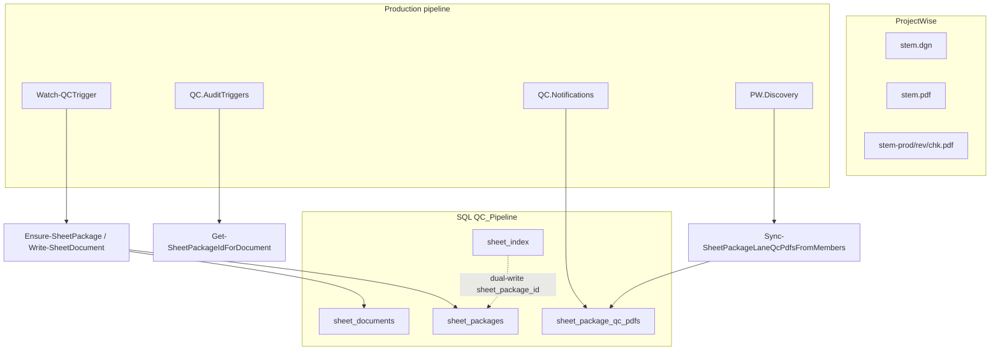

# QC Package Model (SQL-backed)

Production QC treats related ProjectWise sheet artifacts as a single **sheet package** persisted in SQL. Package identity, document membership, and per-lane QC PDF registry are owned by [`modules/Database/Core.Database.psm1`](../../modules/Database/Core.Database.psm1).

> **Archived v1:** An earlier in-memory `QC.Package*` module cluster (`Resolve-QCPackage`, attribute/state sync, fictional `QCPackageCache`) lived under `modules/` and was never wired into production. It was archived in Phase 3 to [`archive/package-model-v1/`](../../archive/package-model-v1/). See [`docs/archive/phase/phase-2-package-model-decision.md`](../archive/phase/phase-2-package-model-decision.md) and [`docs/archive/phase/phase-3-package-model-archive-summary.md`](../archive/phase/phase-3-package-model-archive-summary.md).

## Package identity

A sheet package groups documents that share the same **folder path** and **sheet stem** (base name without lane suffix):

- **DGN** — source design file (`*.dgn`)
- **Sheet PDF** — production sheet PDF (`{stem}.pdf`)
- **Lane QC PDFs** — `{stem}-prod.pdf`, `{stem}-rev.pdf`, `{stem}-chk.pdf` per `QC_Process_Type` / lane registry

Package primary key: `sheet_package_id` (`UNIQUEIDENTIFIER`) in `sheet_packages`.

## SQL tables

| Table | Role |
|-------|------|
| `sheet_packages` | One row per `(folder_path, sheet_stem)`; package identity and rollup fields |
| `sheet_documents` | Per-document membership (`dgn`, `sheet_pdf`, `qc_pdf`, `other`) |
| `sheet_package_qc_pdfs` | Lane QC PDF registry (`production` / `review` / `check`); canonical for lane GUID and PW state mirror |
| `sheet_index` | Operational index; dual-writes `sheet_package_id`; legacy `qc_pdf_name` / `qc_pdf_guid` columns remain |

Schema details and migrations: see `docs/data/database-telemetry.md` and `sql/` migrations (v1.15+ package tables, v1.19 lane registry).

## Key functions (`Core.Database.psm1`)

| Function | Purpose |
|----------|---------|
| `Resolve-SheetPackageFromDocument` | Derive stem and document role from name + folder |
| `Ensure-SheetPackage` | Upsert `sheet_packages` row (does not overwrite `pw_state_name` on update) |
| `Write-SheetDocument` | Upsert document membership in `sheet_documents` |
| `Get-SheetPackageIdForDocument` | Resolve document GUID → `sheet_package_id` |
| `Resolve-SheetPackageIdForSheetGroup` | Sheet-group resolution for audit triggers |
| `Upsert-SheetPackageQcPdf` | Lane PDF row in `sheet_package_qc_pdfs` |
| `Sync-SheetPackageLaneQcPdfsFromMembers` | Discovery-driven lane registry sync |
| `Update-SheetPackageQcPdfLaneState` | Per-lane ProjectWise state mirror |

## Production consumers

| Consumer | Usage |
|----------|-------|
| `Watch-QCTrigger.ps1` / `Run-QCProcessor.ps1` | Bootstrap `Core.Database` |
| `QC.AuditTriggers.psm1` | `Get-SheetPackageIdForDocument`, `Resolve-SheetPackageIdForSheetGroup` |
| `QC.Notifications.psm1` | GUID resolution via `sheet_package_qc_pdfs` |
| `QC.NotificationThreads.psm1` | `Get-SheetPackageIdForDocument` |
| `QC.DebugMcp.psm1` | Reads `sheet_packages` / `sheet_package_qc_pdfs` |
| `PW.Discovery.psm1` | `Sync-SheetPackageLaneQcPdfsFromMembers` |
| `Core.Telemetry.psm1` | Dual-write via `Core.Database` |
| `scripts/Reset-QCFolderWorkflow.ps1` | Lane registry maintenance |
| `QC.Reporting.psm1` | `Get-QCPackageReportingRows` → SQL view `v_sheet_package_status` |

## Workflow and metadata

- **Lane workflow** — prepend, notifications, and per-lane state use `sheet_package_qc_pdfs` and TYPSA three-lane naming (`-prod`, `-rev`, `-chk`). See [`docs/workflow/qc-workflow-framework.md`](../workflow/qc-workflow-framework.md).
- **Reporting** — `QC.Reporting.psm1` aggregates package status from `v_sheet_package_status`; this is separate from the archived in-memory package resolver.
- **Job dedupe** — queue dedupe keys are computed in `QC.JobFactory.psm1` without requiring the archived package modules. The former `metadata.package` branch was removed in Phase 3 (`docs/archive/phase/phase-3-jobfactory-package-dedupe-decision.md`); production paths use file/folder dedupe only.

## Tests

SQL package path tests (retained under `test/`):

- `test_sheet_package_resolution.ps1`, `test_sheet_package_incomplete.ps1`, `test_sheet_package_dual_write.ps1`
- `test_sheet_package_backfill.ps1`, `test_sheet_package_qc_pdfs_schema.ps1`, `test_sheet_package_phase4.ps1`
- `test_qc_lane_state_independence.ps1`, `test_qc_lane_pdf_guid_sync.ps1`, `test_qc_notification_guid_resolve.ps1`
- Additional lane/trigger/completion tests listed in [`docs/archive/phase/phase-2-package-model-decision.md`](../archive/phase/phase-2-package-model-decision.md)
