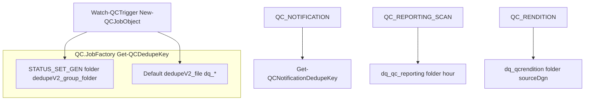

# Phase 3 — JobFactory Package Dedupe Decision

**Branch:** `phase-3/jobfactory-package-dedupe-decision`  
**Date:** 2026-06-22  
**Decision:** **Option B — Remove dead branch**

---

## Executive summary

After the in-memory `QC.Package*` model was archived, [`modules/Queue/QC.JobFactory.psm1`](../modules/Queue/QC.JobFactory.psm1) still contained an unwired package dedupe path: `New-QCPackageJobDedupeKey` and a `Get-QCDedupeKey` branch keyed on `job.metadata.package`. Phase 2/3 investigation found **no production code populates `metadata.package`**.

**Chosen action (Option B):** Remove `New-QCPackageJobDedupeKey` and the `metadata.package` branch. Production queue dedupe behavior is unchanged because the branch never executed in live paths.

Package-level notification dedupe remains in [`modules/Notifications/QC.Notifications.psm1`](../modules/Notifications/QC.Notifications.psm1) via `Get-QCNotificationDedupeKey` / `Get-QCNotificationSheetPackageDedupeKey` (SQL-aware, separate from JobFactory).

---

## Branch setup

| Item | Value |
|------|-------|
| Base branch | `dev` |
| Feature branch | `phase-3/jobfactory-package-dedupe-decision` |
| Working tree at start | Clean |

---

## Caller / reference table

| Symbol / pattern | Location | Classification | Action |
|------------------|----------|----------------|--------|
| `New-QCPackageJobDedupeKey` | `QC.JobFactory.psm1` | Dead/unwired | **Removed** |
| `Get-QCDedupeKey` (package branch) | `QC.JobFactory.psm1` | Dead/unwired | **Removed** |
| `Get-QCDedupeKey` (folder/file paths) | `QC.JobFactory.psm1` | Production path | Unchanged |
| `New-QCJobObject` | `QC.JobFactory.psm1` | Production path | Unchanged |
| `New-QCJobObject` callers | `Watch-QCTrigger.ps1`, `QC.Processors.psm1` | Production path | Unchanged |
| `metadata.package` | Was `QC.JobFactory.psm1` only | Dead/unwired | Branch removed |
| `metadata.package` exercise | `archive/package-model-v1/test/test_qc_package_model.ps1` | Test-only (archived) | Dedupe assertions removed |
| `Test-QCDuplicateJob` | `QC.Queue.Json.psm1` | Production path | Unchanged |
| `Get-QCNotificationDedupeKey` | `QC.Notifications.psm1` | Production path | Unchanged |
| `Get-QCNotificationSheetPackageDedupeKey` | `QC.Notifications.psm1` | SQL-backed package logic | Unchanged |
| `sheet_package_id` | `Core.Database.psm1`, telemetry | SQL-backed active | Unchanged |
| `sheet_package_id` on queue jobs | `QC.Workflow.psm1` (QC_NOTIFICATION metadata) | Production path | Unchanged |
| `QC_REPORTING_SCAN` dedupe | `QC.Reporting.psm1` | Production path (bypasses JobFactory) | Unchanged |
| `QC_RENDITION` dedupe | `QC.Rendition.psm1` | Production path (bypasses JobFactory) | Unchanged |
| `New-QCProcessingJob` | Not in repo | N/A | Closest: `New-QCJobObject` + SQL `Write-QCProcessingJob` |

---

## Current dedupe behavior (production)

| Job type | Dedupe mechanism | Granularity | QC_Process_Type in key? | sheet_package_id at job creation? |
|----------|------------------|-------------|-------------------------|-----------------------------------|
| **QC_PREPEND** | `Get-QCDedupeKey` via `New-QCJobObject` | Document-level (`type+rule+path`); +fileHash; +stateTransitionKey for qc-initiated/finalizing rules | No | No |
| **QC_COMMENT_STATUS_SYNC** | Same file path as prepend | Document-level + fileHash | No | No |
| **STATUS_SET_GEN** | `Get-QCDedupeKey` when grouping by folder | Folder-level (`root+folder+folderStateHash`) | No | No |
| **QC_NOTIFICATION** | `Get-QCNotificationDedupeKey` | Sheet-transition-level; optional qcProcessType / sheetPackageId via config | Yes (when configured) | Sometimes in notification metadata |
| **QC_REPORTING_SCAN** | `New-QCReportingScanJob` | Folder + hourly bucket | No | No |
| **QC_RENDITION** | `_QCR-GetRenditionDedupeKeyForSheet` | Sheet-level (folder + source DGN) | No | No |

**Removed (never used in production):** `metadata.package` → `dq_pkg_*` keys from legacy in-memory `PackageId`, not SQL `sheet_package_id`.

---

## Decision options

| Option | Summary | Outcome |
|--------|---------|---------|
| A — Keep as-is | Leave dead branch | Rejected — misleading after archive |
| **B — Remove dead branch** | Delete `New-QCPackageJobDedupeKey` + `metadata.package` branch | **Chosen** |
| C — Wire to SQL | `sheet_package_id`-based dedupe at job creation | Rejected — behavior change, cross-lane risk |
| D — Deprecate + tests | Keep function, mark deprecated | Not needed — branch had zero callers |

---

## Risk analysis (Option B)

| Risk | Severity | Mitigation |
|------|----------|------------|
| Duplicate job suppression regression | None | Branch never ran in production |
| Cross-lane / cross-process-type suppression | None | No change to active dedupe paths |
| External job producer with `metadata.package` | Low | No repo caller; undocumented |
| Queued job replay | None | `dedupeKey` already stored on job JSON at enqueue |
| Archived test breakage | Low | Removed package-dedupe assertions; dropped unused JobFactory import |

---

## Implementation (Option B)

| File | Change |
|------|--------|
| `modules/Queue/QC.JobFactory.psm1` | Removed `New-QCPackageJobDedupeKey` and `metadata.package` branch in `Get-QCDedupeKey` |
| `archive/package-model-v1/test/test_qc_package_model.ps1` | Removed package dedupe assertions; removed unused `QC.JobFactory` import |
| `archive/package-model-v1/README.md` | Updated deferred note |
| `test/test_job_factory.ps1` | Assert production jobs do not use `dq_pkg_` prefix |
| `docs/archive/phase/phase-3-jobfactory-package-dedupe-decision.md` | This document |

**Not modified:** `Core.Database.psm1`, SQL schema, watcher, processor, notification, ProjectWise, Graph, MCP, prepend, `appsettings.json`, native prepend.

---

## Validation plan and results

| Suite | Result |
|-------|--------|
| `python -m pytest tests/ -q` | **86 passed, 3 skipped** |
| `test/run_focus_tests.ps1` | **ALL PASSED** |
| `test/test_module_inventory.ps1` | **PASS** (41 modules) |
| `test/test_watcher_module_bootstrap.ps1` | **PASS** |
| `test/test_queue_json.ps1` | **PASS** |
| `test/test_job_factory.ps1` | **PASS** |
| `test/test_qc_comment_dedupe.ps1` | **PASS** |

---

## Out of scope (unchanged)

- Queue dedupe behavior for active job types
- Job metadata shape for production enqueue paths
- SQL schema and `Core.Database.psm1`
- Watcher, processor, notification, ProjectWise, Graph, MCP, prepend behavior
- `appsettings.json` and native prepend
