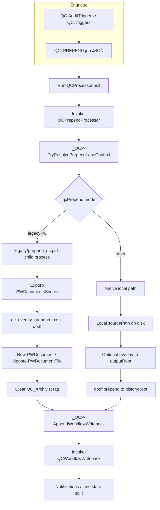

# Phase 2 Branch 4 — Native Prepend Parity Plan

**Branch:** `phase-2/native-prepend-parity-plan`  
**Date:** 2026-06-22  
**Scope:** Plan only. No changes to `qcPrepend.mode`, `legacy/prepend_qc.ps1`, or native/legacy prepend implementation.

---

## Executive summary

Production `QC_PREPEND` jobs route through **`legacy/prepend_qc.ps1`** when `qcPrepend.mode: "legacyPw"` (committed default in `appsettings.json`). A **native** path exists in [`modules/Processing/QC.Processors.psm1`](../modules/Processing/QC.Processors.psm1) (`mode` other than `legacypw`) but performs **local file I/O only** — no ProjectWise export/import.

**Recommendation:** **Native prepend is not ready for production flip.** Close P0 gaps (PW I/O parity, golden tests, check/review history without overlay) before any pilot of `qcPrepend.mode: local` (or a future `nativePw` mode).

`legacy/prepend_qc.ps1` remains **production-relevant** and must not be removed while `legacyPw` is in use.

---

## Call graphs

### End-to-end



### Shared path (both modes)

1. `_QCP-TryResolvePrependLaneContext` — resolves `QC_Process_Type`, `pdfSuffix`, `expectedLanePdfName` (`*-prod/-rev/-chk.pdf`)
2. `_QCP-AppendWorkflowWriteback` → `Invoke-QCWorkflowWriteback`
3. `Sync-PWPostInitialPrependLaneStates` (initial prepend, lane-independent)
4. `Set-PWQCWorkflowState` + notification enqueue
5. `_QCP-TryResetProcessTypeAfterPrepend`

### Legacy-only path (`legacyPw`)

[`Invoke-QCPrependProcessor`](../modules/Processing/QC.Processors.psm1) lines ~1345–1568:

- Spawns `powershell.exe -MTA -File legacy\prepend_qc.ps1`
- Passes `-QcProcessType`, `-QcPdfSuffix`, `-HistoryDocumentName`, `-PrependTrigger`, overlay flags
- [`legacy/prepend_qc.ps1`](../legacy/prepend_qc.ps1): PW export → merge/stamp → `Update-PWDocumentFile` / `New-PWDocument`
- In-script attribute sync: `Sync-PWQcPdfEmailAttributesFromSourcePdf`, `_PWD-EnsureLaneQcPdfProcessTypeAttribute`
- Processor clears `QC_Archivist` tag after legacy success

### Native-only path

[`Invoke-QCPrependProcessor`](../modules/Processing/QC.Processors.psm1) lines ~1571+:

- Requires local `Job.sourcePath` on worker disk
- History: `{historyRoot}/{folderKey}/{expectedLanePdfName}`
- Overlay output: `{outputRoot}/{folderKey}/{expectedLanePdfName}` when enabled
- **No PW export/import**
- Check/review lanes without overlay: fails `QC_PREPEND_LANE_HISTORY_SKIPPED`
- Production lane: overlay → `outputRoot`, then qpdf prepend → `historyRoot`

---

## Behavior comparison table

| Concern | Legacy (`legacyPw` → `prepend_qc.ps1`) | Native (`local` / default in code) |
|---------|----------------------------------------|-------------------------------------|
| **Entry** | Child PS process to `legacy\prepend_qc.ps1` | In-process `QC.Processors.psm1` |
| **PDF selection** | PW: `sourceName` in `sourceFolder` | Local `Job.sourcePath` must exist |
| **PW export** | Yes (`Export-PWDocumentsSimple`) | **No** |
| **PW import** | Yes (`New-PWDocument` / `Update-PWDocumentFile`) | **No** |
| **Lane PDF target** | PW document `{stem}-prod/-rev/-chk.pdf` | Local files only |
| **`*-qc.pdf` bridge** | Standalone invoke without lane params | Never created |
| **Overlay** | `qc_overlay_prepend.exe`; `OverlayOldFromHistoryOnly`, sheet work dir | Same exe via `_QCP-RunOverlayExe` |
| **qpdf history merge** | Yes (in legacy script) | Yes (production lane; check/review gated) |
| **Review stamp** | `Invoke-QcReviewStampIfNeeded` in legacy | `_QCP-TryApplyReviewStampFromJob` |
| **PW attribute sync** | In `prepend_qc.ps1` | Relies on workflow writeback path only |
| **QC_Archivist tag clear** | Yes (processor after legacy) | N/A |
| **Workflow writeback** | `_QCP-AppendWorkflowWriteback` | Same |
| **Notifications** | Via `Set-PWQCWorkflowState` | Same |
| **Lane GUID registry** | Writeback + partial worker path | Worker uses `resultData.qcOutputPdf` (legacy success often omits) |
| **Dry-run** | `QC_PREPEND_DRYRUN` planned args | Local dry-run path |

---

## Known gaps

### P0 — Blockers before mode flip

| # | Gap | Detail |
|---|-----|--------|
| 1 | **No native PW I/O** | Cannot replace legacy until native exports incoming PDF from PW, merges, and uploads lane PDF |
| 2 | **No legacy ↔ native parity test** | No golden-PDF or mocked-PW end-to-end comparison |
| 3 | **Check/review without overlay unsupported** | Native fails `QC_PREPEND_LANE_HISTORY_SKIPPED`; legacy always writes lane PDF in PW |

### P1 — Behavioral deltas to close or document

| # | Gap | Detail |
|---|-----|--------|
| 4 | `*-qc.pdf` bridge | Legacy standalone still creates `{stem}-qc.pdf`; native never does |
| 5 | Attribute sync timing | Legacy syncs emails/`QC_Process_Type` inside prepend; native depends on workflow module |
| 6 | Overlay work-dir | Legacy `work\{baseName}\` tree + page-1 slice; native `--sheet-work-dir` only when config path set |
| 7 | Worker telemetry | `Run-QCProcessor.ps1` registers lane GUID when `resultData.qcOutputPdf` set; legacy payload may omit it |
| 8 | Source availability | Jobs enqueue with PW paths; native needs pre-exported local file or export step in processor |

### P2 — Already shared (lower risk)

| # | Area | Notes |
|---|------|-------|
| 9 | Lane resolution | `_QCP-TryResolvePrependLaneContext` well-tested |
| 10 | Workflow writeback | Shared `_QCP-AppendWorkflowWriteback` |
| 11 | Enqueue dedupe | `Test-QCPrependEnqueueBlockedForSheet` path-agnostic |
| 12 | `PrependTrigger` | Propagated to legacy via `-PrependTrigger` |

---

## Required test matrix (before flip)

| ID | Test | Type | Pass criteria |
|----|------|------|---------------|
| T1 | Same stem PDF + lane history through **both** modes | Golden PDF | Page count, overlay layers match within tolerance |
| T2 | PW document name after prepend | Integration / sandbox PW | `{stem}-prod.pdf` exists with correct version |
| T3 | `QC_Process_Type` on lane PDF | PW attribute read | Matches job metadata |
| T4 | Workflow state after `initialQcPdf` | PW state | TYPSA `Originated` (or configured target) |
| T5 | Notification dedupe with `qcProcessType` | Unit + integration | No cross-lane suppression |
| T6 | Check lane without overlay | Native negative | Document expected failure until implemented |
| T7 | Legacy `*-qc.pdf` standalone | Legacy only | Document bridge still works; not parity target |
| T8 | `QC_Archivist` tag cleared | Legacy | Tag absent after success |
| T9 | Lane GUID in `sheet_package_qc_pdfs` | SQL | Row updated after prepend |
| T10 | End-to-end `legacyPw` processor branch | Currently **missing** | Add processor-level test with mocked PW |

### Existing tests (partial coverage)

| Test | Covers |
|------|--------|
| `test/test_qc_prepend_processor.ps1` | Native local path only |
| `test/test_qc_prepend_lane_resolution.ps1` | Shared lane resolution + legacy param presence |
| `test/test_qc_prepend_sheet_dedupe.ps1` | Enqueue blocking |
| `test/test_qc_workflow.ps1` | Workflow writeback attachment (native) |
| `test/test_qc_post_initial_prepend_states.ps1` | Lane state split |
| `test/test_qc_lane_workflow_writeback.ps1` | Lane writeback + legacy name normalization |
| `test/test_qc_prepend_stamp_integration.ps1` | Stamp integration |
| `tests/test_qc_overlay_prepend.py` | Overlay exe contract |

---

## Controlled server validation plan

### Prerequisites

- All target sheets folders on TYPSA lane PDFs (`*-prod/-rev/-chk`); no new `*-qc.pdf` dependency
- `qcWorkflow` validated on pilot project
- `qc_overlay_prepend.exe` and qpdf deployed on worker
- SQL telemetry enabled for lane registry verification

### Phase A — Shadow logging (no mode flip)

1. Keep `qcPrepend.mode: legacyPw` in production `appsettings.json`.
2. On a **non-production worker**, run native path in dry-run for same jobs (custom logging or forked processor).
3. Diff: lane params, expected output paths, overlay command lines.

### Phase B — Sandbox PW pilot (single sheet)

1. Clone job payload for one `QC_PREPEND` on a test folder.
2. Run legacy path → record PW doc version, attributes, state, SQL lane rows.
3. Run native path (after P0 PW I/O implemented) on same inputs → compare.
4. Roll back test documents manually if needed.

### Phase C — Controlled flip (one worker)

1. Set `qcPrepend.mode: local` (or future `nativePw`) on **one** worker only.
2. Monitor: `QC_PREPEND_LEGACY_*` vs `QC_PREPEND_*` result codes, queue failures, notification volume.
3. Duration: minimum one full QC cycle on pilot project.

### Phase D — Full rollout

1. Flip all workers after Phase C success criteria met.
2. Keep `legacy/prepend_qc.ps1` in repo until one release cycle with zero legacy invocations.

---

## Rollback plan

| Trigger | Action |
|---------|--------|
| Any `QC_PREPEND_WORKFLOW_WRITEBACK_FAILED` spike in strict mode | Revert `qcPrepend.mode` to `legacyPw` in `appsettings.json` (or worker-local override) |
| PW upload failures / missing lane PDFs | Immediate revert; re-run failed jobs after mode restore |
| Lane GUID registry drift | Pause flip; run `Sync-SheetPackageLaneQcPdfsFromMembers` reconciliation |

**Rollback command (config):**

```json
"qcPrepend": {
  "mode": "legacyPw"
}
```

Restart affected workers. No database migration rollback required for mode flip alone.

---

## Recommendation

| Question | Answer |
|----------|--------|
| Is native prepend ready to test in production? | **No** |
| Is native prepend ready for sandbox/PW pilot? | **Only after P0 item 1 (PW I/O module)** |
| Should `legacy/prepend_qc.ps1` be removed? | **No** while `legacyPw` is committed default |
| Suggested new mode name for future PW-native path? | `nativePw` (distinct from filesystem-only `local`) |

### Proposed implementation sequence (Phase 3+)

1. Extract PW export/import/stamp steps from `legacy/prepend_qc.ps1` into callable functions (or shared module).
2. Invoke from native branch before/after local merge — **parity first**, then flip mode.
3. Add T1–T10 tests; require green before any server pilot.
4. Implement check/review history path without overlay (or require overlay in config for all lanes).
5. Align legacy success `Data` payload with native (`qcOutputPdf`, lane metadata) for worker telemetry.

---

## Validation results (Branch 4)

Documentation-only branch. No production code changed.

| Suite | Result |
|-------|--------|
| `python -m pytest tests/ -q` | **86 passed, 3 skipped** |
| `test/run_focus_tests.ps1` | **ALL PASSED** |
| `test/test_module_inventory.ps1` | **PASS** (46 modules) |
| `test/test_watcher_module_bootstrap.ps1` | **PASS** |
