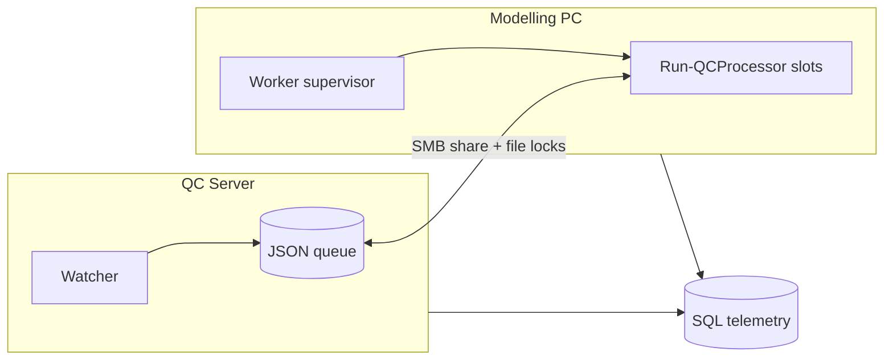

# Remote Worker Architecture — Intent

**Status:** Phase 2 live on the modelling PC (UNC prepend + scheduled task). Host resource throttle is in repo (opt-in via `appsettings.local.json`; committed defaults remain off).  
**Date:** 2026-06-24  
**Primary deployment target:** Drainage team modelling workstation (shared hydraulic modelling PC)

---

## Why this work exists

The QC pipeline today runs entirely on a Windows Server 2019 host: watcher, JSON queue, SQL telemetry, and one or more local `Run-QCProcessor.ps1` workers. That server is the right place for **coordination** — audit-driven discovery, enqueue, reconciliation, and queue ownership.

The drainage team also has a powerful shared workstation used for hydraulic models (OpenFlows / InfoWorks / similar). That machine has spare capacity when models are not running, but it must remain usable for modelling during the day. We want QC **processors** (especially heavy `QC_PREPEND` work) to run there when safe, without moving the watcher off the server or breaking single-server production behavior.

This document states **intent and constraints** for that design. Detailed architecture, config shapes, and implementation steps will live in follow-up work on this repo.

---

## Goal

Keep the **server as coordinator** (watcher + queue owner) and add **optional remote workers** on the modelling PC that:

- Claim jobs from the **same JSON queue** safely (no duplicate processing).
- Run under a **dedicated service account**, independent of who is logged in interactively.
- Report **heartbeat, status, and job context** for operations visibility.
- **Throttle or pause** new job claims when hydraulic modelling activity is detected.

Remote workers must **not** take over watcher responsibilities, enqueue jobs, or replace the JSON queue as the execution scheduler.

---

## Current state (baseline)

| Component | Today |
|-----------|--------|
| Watcher | `Watch-QCTrigger.ps1` on QC server |
| Queue | JSON folders (`pending/`, `running/`, `succeeded/`, `failed/`, `locks/`) |
| Workers | `Run-QCProcessor.ps1`, spawned by `Start-QCPipelineDashboard.ps1` on the server |
| Job claim | `Get-NextQCJob` + `Lock-QCJob` with file locks and local PID liveness |
| SQL | Telemetry only (`processing_jobs` mirrors outcomes; not a job scheduler) |
| Parallel workers | Supported on **one machine** (see `test/powershell/test_worker_pool_dispatch.ps1`) |

Production runtime: **PowerShell 5.1**, ProjectWise via **pwps_dab** (`-MTA` required).

---

## Target state (high level)

- **Server:** watcher, queue path, optional reduced local worker pool, stale job recovery.
- **Modelling PC:** supervisor + N processor slots; no watcher.
- **Queue:** remains JSON-based on a path both hosts can reach (UNC share from server).
- **SQL:** adds worker registry / heartbeat telemetry (does not dequeue jobs).

---

## Non-negotiable constraints

1. **Watcher stays on the server** — remote hosts do not enqueue or run reconciliation sweeps.
2. **JSON queue remains the execution source of truth** — see [`docs/data/database-telemetry.md`](../data/database-telemetry.md).
3. **Backward compatibility** — existing `Run-QCProcessor.ps1` entrypoint and server dashboard behavior must keep working when remote workers are disabled.
4. **No interactive session required** — processors run as a scheduled task (or later a service) under a dedicated account, not the shared D-Team login.
5. **Safe queue mutation only** — remote workers use existing `Lock-QCJob` / `Move-QCJob` paths; no uncoordinated file edits.
6. **Cross-machine locking** — lock files include `machineName` + `pid`. Job JSON in `running/` / `succeeded/` / `failed/` stores the same owner fields; `processing_jobs.worker_machine_name` / `worker_pid` mirror them for SQL. Same-host liveness still uses PID. Other-host per-job locks are never stolen via local `Get-Process`; `Recover-QCStaleJobs` uses job `heartbeatUtc`. Deploy this lock code on the QC server **before** the modelling PC claims the UNC queue. See [`remote-worker-host-guardrails.md`](remote-worker-host-guardrails.md).

---

## Modelling PC role

This repo clone on the modelling workstation is intended to become a **remote worker host**, not a second pipeline coordinator.

| Runs on modelling PC | Does not run on modelling PC |
|----------------------|------------------------------|
| `Start-QCRemoteWorkerHost.ps1` (processor-only supervisor) | `Watch-QCTrigger.ps1` |
| One or more `Run-QCProcessor.ps1` children | `Start-QCPipelineDashboard.ps1` (full pipeline) |
| Local `qcPrepend` temp/output paths (fast disk) | Watcher audit polling / enqueue |

Deploy code via existing [`scripts/Publish-QCPipelineCode.ps1`](../../scripts/Publish-QCPipelineCode.ps1). Per-machine settings go in gitignored `appsettings.local.json` (queue UNC path, SQL connection, PW secrets, throttle rules).

---

## Resource-aware throttling (intent)

The modelling PC is shared with hydraulic modelling. Remote QC work must defer when models are active.

**In repo (`workers.remoteHost.throttle`):** the remote-host supervisor samples machine-wide CPU, physical memory, and `Win32_Process` names across all sessions (including disconnected `dteam`). A status file `queue\_remote_worker.{host}.throttle.json` records `pauseNewClaims` / `recommendedSlots`. When busy, the pool scales down to `busyRecommendedSlots` (default 1) instead of going idle unless that value is 0. Extra `Run-QCProcessor` children stay alive but skip `Get-NextQCJob`. In-flight prepend/writeback is never aborted. Missing, stale, malformed, or `sample_error` status **fails open** (claims continue). Committed `appsettings.json` keeps throttle disabled; enable only in gitignored `appsettings.local.json`.

Process Lasso (or similar) should exclude QC supervisor/worker PowerShell processes as an **ops** setting — that is not encoded in QC.

SQL `qc_workers` / dashboard worker registry is still a later visibility slice. This throttle is a local host control plane only.

---

## Phased delivery (intent only)

| Phase | Focus |
|-------|--------|
| **1** | Local simulation: supervisor + multiple `Run-QCProcessor` instances on one machine; job-type filters |
| **2** | Remote worker on modelling PC: shared queue over UNC; host-aware locks; scheduled task under service account |
| **3** | Worker heartbeat and SQL telemetry (`qc_workers`); dashboard/diagnostic visibility |
| **4** | Resource-aware throttling on modelling PC (in repo; opt-in local overlay) |
| **5** | Production hardening: gMSA, alerting, optional Windows Service, runbooks |

Phase 1 should not require network shares or SQL schema changes. Phase 2 is the first production-facing milestone on the modelling PC.

---

## Service model (first implementation)

**Recommended first approach:** Windows **Scheduled Task** (not Windows Service).

- Run whether user is logged on or not.
- Use `powershell.exe -MTA -File ...` for pwps_dab compatibility (same as the server dashboard).
- One task runs a supervisor script that manages processor slots; easier to iterate than a custom service host on PS 5.1.

Windows Service remains an option for Phase 5 if operations want SCM recovery and centralized logging.

---

## Success criteria

- Server watcher and queue behavior unchanged when remote workers are off.
- Remote workers drain eligible jobs without duplicate `succeeded` outcomes.
- Stale/crashed remote worker jobs are recovered via heartbeat-aware `Recover-QCStaleJobs`.
- Modelling workload takes priority: QC claims pause under throttle rules; no user login required.
- Operators can see which host processed which job (`worker_id`, host name in logs and SQL).

---

## Out of scope (for this initiative)

- Moving the watcher to the modelling PC or any second coordinator.
- Replacing the JSON queue with SQL-based job scheduling.
- Requiring Python on production worker hosts (overlay exe only, per [`AGENTS.md`](../../AGENTS.md)).
- Running QC under the shared interactive D-Team account.

---

## Related docs and code

| Resource | Purpose |
|----------|---------|
| [`docs/engineering/remote-worker-host-guardrails.md`](remote-worker-host-guardrails.md) | Modelling-PC clone: processor host only; UNC claims need `-AllowUncQueue` |
| [`AGENTS.md`](../../AGENTS.md) | Production constraints, entrypoints, queue invariants |
| [`docs/data/database-telemetry.md`](../data/database-telemetry.md) | SQL vs JSON queue roles |
| [`docs/reference/appsettings-reference.md`](../reference/appsettings-reference.md) | Current `workers` config |
| [`modules/Queue/QC.Queue.Json.psm1`](../../modules/Queue/QC.Queue.Json.psm1) | Queue, locks, recovery |
| [`modules/Queue/QC.HostThrottle.psm1`](../../modules/Queue/QC.HostThrottle.psm1) | Host resource sample, evaluate, status file |
| [`scripts/service/Run-QCProcessor.ps1`](../../scripts/service/Run-QCProcessor.ps1) | Worker entrypoint (`enabledJobTypes`, `-AllowUncQueue`) |
| [`scripts/service/Start-QCRemoteWorkerHost.ps1`](../../scripts/service/Start-QCRemoteWorkerHost.ps1) | Processor-only supervisor |
| [`test/powershell/test_worker_pool_dispatch.ps1`](../../test/powershell/test_worker_pool_dispatch.ps1) | Parallel worker safety test |

---

## Next steps

1. On the modelling PC, copy throttle keys from `appsettings.remote-worker.example.json` into gitignored `appsettings.local.json` and set `workers.remoteHost.throttle.enabled` to `true`, then restart `QC-RemoteWorkerHost`.
2. SQL `qc_workers` heartbeat / dashboard host visibility remains a later slice (intent Phase 3).
