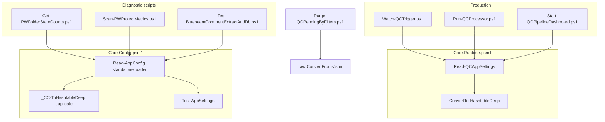
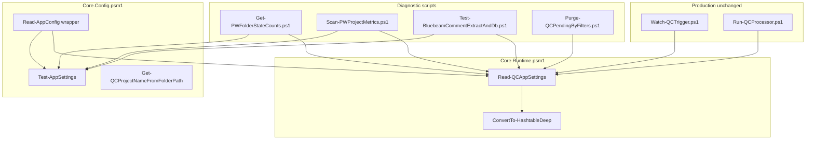

# Phase 2 Branch 2 — Config Loader Consolidation Summary

**Branch:** `phase-2/config-loader-consolidation`  
**Date:** 2026-06-22  
**Scope:** Consolidate duplicate config loaders without changing production pipeline behavior.

---

## Call graph — before



## Call graph — after



---

## Files changed

| File | Change |
|------|--------|
| `modules/Core.Config.psm1` | `Read-AppConfig` → thin wrapper over `Read-QCAppSettings` + `Test-AppSettings`; `_CC-ToHashtableDeep` delegates to `ConvertTo-HashtableDeep` |
| `scripts/Get-PWFolderStateCounts.ps1` | `Read-QCAppSettings` + `Test-AppSettings`; removed local `_ToHashtable` |
| `scripts/Scan-PWProjectMetrics.ps1` | Same |
| `tools/discovery/Test-BluebeamCommentExtractAndDb.ps1` | Same; imports `Core.Runtime` |
| `scripts/Purge-QCPendingByFilters.ps1` | `Read-QCAppSettings`; removed local `ConvertTo-HashtableDeep` |
| `test/test_qc_email_templates.ps1` | `Read-QCAppSettings` instead of raw `ConvertFrom-Json` |
| `modules/README.md` | Updated `Core.Config` export description |

**Not changed (deferred B2.3):** shallow `_QC*-ToHashtable` helpers in pipeline modules.

---

## Functions retained as compatibility wrappers

| Function | Module | Role |
|----------|--------|------|
| `Read-AppConfig` | `Core.Config.psm1` | External/diagnostic API; delegates to `Read-QCAppSettings`, maps `CONFIG_PARSE_ERROR` → `CONFIG_PARSE_FAILED` |
| `_CC-ToHashtableDeep` | `Core.Config.psm1` | Thin delegate to `ConvertTo-HashtableDeep` (no independent implementation) |
| `Test-AppSettings` | `Core.Config.psm1` | Unchanged validation logic |
| `Get-QCProjectNameFromFolderPath` | `Core.Config.psm1` | Unchanged |

## Functions removed

| Function | Location | Replacement |
|----------|----------|-------------|
| Standalone `Read-AppConfig` JSON parse path | `Core.Config.psm1` | `Read-QCAppSettings` |
| `_CC-ToHashtableDeep` implementation | `Core.Config.psm1` | `ConvertTo-HashtableDeep` |
| `_ToHashtable` | `Get-PWFolderStateCounts.ps1`, `Scan-PWProjectMetrics.ps1` | Config already hashtable from loader |
| `ConvertTo-HashtableDeep` (local) | `Purge-QCPendingByFilters.ps1` | `Read-QCAppSettings` |

---

## Behavior preservation

| Aspect | Preserved? | Notes |
|--------|------------|-------|
| Merge order (`appsettings.json` → `.local` → `.secrets`) | Yes | Diagnostic scripts now get overlays they previously missed |
| JSON comment stripping | Yes | Via `Read-QCAppSettings` |
| `Test-AppSettings` validation on diagnostic scripts | Yes | Explicit call after load |
| Production pipeline loaders | Yes | `Watch-QCTrigger`, `Run-QCProcessor`, etc. untouched |
| `appsettings.json` defaults | Yes | No config file edits |
| Secrets handling | Yes | Unchanged merge chain |
| `Read-AppConfig` return shape | Yes | `Data.path` + `Data.config` on success |
| Timezone setup | Additive | `Read-QCAppSettings` sets display timezone (wrapper and migrated callers) |

---

## Validation results

| Suite | Result |
|-------|--------|
| `python -m pytest tests/ -q` | **86 passed, 3 skipped** |
| `test/run_focus_tests.ps1` | **ALL PASSED** |
| `test/test_config_profile_merge.ps1` | **PASS** |
| `test/test_config_json_comments.ps1` | **PASS** |
| `test/test_module_inventory.ps1` | **PASS** (46 modules) |
| `test/test_watcher_module_bootstrap.ps1` | **PASS** |

**Diagnostic smoke:** PW-connected scripts (`Get-PWFolderStateCounts`, `Scan-PWProjectMetrics`) not run against live PW in this session (require credentials).

---

## Known external dependency risks

| Risk | Mitigation |
|------|------------|
| External automation dot-sourcing `Read-AppConfig` | Wrapper preserved; now includes merge chain + timezone |
| Scripts expecting single-file load only | `Read-AppConfig`/`Read-QCAppSettings` with `appsettings.json` still merges `.local`/`.secrets` when present — additive, not breaking |
| `CONFIG_PARSE_FAILED` vs `CONFIG_PARSE_ERROR` | Wrapper maps to legacy code for `Read-AppConfig` callers |

---

## Rollback

```powershell
git revert <branch-2-commit-sha>
```

---

## Deferred to future branch (B2.3)

Consolidate 10+ shallow `_QC*-ToHashtable` helpers across pipeline modules — not in this branch per approval gate.
