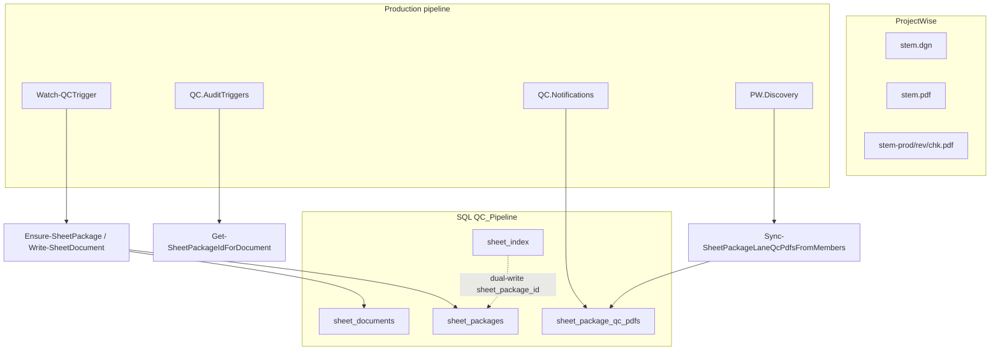

# Phase 2 Branch 3 — Package Model Decision

**Branch:** `phase-2/package-model-decision`  
**Date:** 2026-06-22  
**Scope:** Investigation and documentation only. No module deletions, no schema changes, no production behavior changes.

---

## Executive summary

**Production package grouping is SQL-backed** via `sheet_packages`, `sheet_documents`, and `sheet_package_qc_pdfs` in [`modules/Core.Database.psm1`](../modules/Core.Database.psm1).

The in-memory **`QC.Package*` module cluster** (`QC.PackageResolver`, `QC.AttributePolicy`, `QC.StatePolicy`, `QC.PackageSync`, `QC.Package.Database`) has **zero production callers**. It is exercised only by [`test/test_qc_package_model.ps1`](../test/test_qc_package_model.ps1) and referenced in [`docs/qc-package-model.md`](qc-package-model.md).

**Recommendation:** **Archive** the in-memory modules (or mark deprecated); **keep** the SQL path; **rewrite** `docs/qc-package-model.md` in Phase 3 to document SQL; **decide** whether to wire or remove the unwired `QC.JobFactory` package dedupe branch.

---

## Current production package model

### Tables (schema v1.15+ / v1.19 lane registry)

| Table | Role |
|-------|------|
| `sheet_packages` | One row per `(folder_path, sheet_stem)`; package identity |
| `sheet_documents` | Per-document membership (`dgn`, `sheet_pdf`, `qc_pdf`, `other`) |
| `sheet_package_qc_pdfs` | Lane QC PDF registry (`production` / `review` / `check`); canonical for lane GUID/state |
| `sheet_index` | Operational index; dual-writes `sheet_package_id`; legacy `qc_pdf_name` columns remain |

### Key SQL functions (`Core.Database.psm1`)

| Function | Purpose |
|----------|---------|
| `Resolve-SheetPackageFromDocument` | Stem/role from document name + folder |
| `Ensure-SheetPackage` | Upsert package row (does not overwrite `pw_state_name` on update) |
| `Write-SheetDocument` | Document membership |
| `Get-SheetPackageIdForDocument` | GUID → `sheet_package_id` |
| `Resolve-SheetPackageIdForSheetGroup` | Sheet-group resolution for triggers |
| `Upsert-SheetPackageQcPdf` | Lane PDF row in `sheet_package_qc_pdfs` |
| `Sync-SheetPackageLaneQcPdfsFromMembers` | Discovery-driven lane registry sync |
| `Update-SheetPackageQcPdfLaneState` | Per-lane PW state mirror |

### Production consumers

| Consumer | Usage |
|----------|-------|
| `QC.AuditTriggers.psm1` | `Get-SheetPackageIdForDocument`, `Resolve-SheetPackageIdForSheetGroup` |
| `QC.Notifications.psm1` | GUID resolution via `sheet_package_qc_pdfs` |
| `QC.NotificationThreads.psm1` | `Get-SheetPackageIdForDocument` |
| `QC.DebugMcp.psm1` | Reads `sheet_packages` / `sheet_package_qc_pdfs` |
| `PW.Discovery.psm1` | `Sync-SheetPackageLaneQcPdfsFromMembers` |
| `Core.Telemetry.psm1` | Dual-write via `Core.Database` |
| `Watch-QCTrigger.ps1` / `Run-QCProcessor.ps1` | Bootstrap `Core.Database` |
| `scripts/Reset-QCFolderWorkflow.ps1` | Lane registry maintenance |
| `QC.Reporting.psm1` | `Get-QCPackageReportingRows` → SQL view `v_sheet_package_status` |

---

## In-memory package module purpose

Designed as a **parallel abstraction** for grouping DGN + production PDF + QC PDF into an in-memory package with:

- `Resolve-QCPackage` — SHA-based `qcpkg_*` package IDs
- `Get-QCPackageCanonicalDocument` — metadata authority selection
- `QC.AttributePolicy` — user vs automation attribute ownership
- `QC.StatePolicy` — package-level state precedence / `Set-PCPackageState`
- `QC.PackageSync` — `Sync-QCPackageAttributes` → `Update-PWDocumentAttributes`
- `QC.Package.Database` — stub `dbo.QCPackageCache` writer (table does not exist)

This design predates or parallels the SQL model but was **never wired** into watcher, processor, or notification paths.

---

## Caller / reference table

| Module | Production callers | Test callers | Internal imports |
|--------|-------------------|--------------|------------------|
| `QC.PackageResolver.psm1` | **None** | `test_qc_package_model.ps1` | `AttributePolicy`, `StatePolicy`, `PackageSync` |
| `QC.AttributePolicy.psm1` | **None** | `test_qc_package_model.ps1` | `PackageResolver` |
| `QC.StatePolicy.psm1` | **None** | `test_qc_package_model.ps1` | `PackageResolver` |
| `QC.PackageSync.psm1` | **None** | `test_qc_package_model.ps1` (dry-run) | `PackageResolver`, `AttributePolicy` |
| `QC.Package.Database.psm1` | **None** | `test_qc_package_model.ps1` | None |

### Related unwired code

| Artifact | Status |
|----------|--------|
| `QC.JobFactory.psm1` → `Get-QCDedupeKey` package branch | Reads `job.metadata.package`; **no production code populates this metadata** |
| `New-QCPackageJobDedupeKey` | Only tested in `test_qc_package_model.ps1` |
| `config.qcPackage` | Referenced in test fixtures only; not in committed production `appsettings.json` |

---

## In-memory vs SQL — divergence

| Dimension | In-memory `QC.Package*` | SQL production |
|-----------|-------------------------|----------------|
| Package key | `qcpkg_*` hash from `folder\|stem` | `UNIQUEIDENTIFIER` `sheet_package_id` |
| QC PDF naming | `_QC`, `-QC`, `_QC_HISTORY` suffixes | `-prod`, `-chk`, `-rev` lanes only in `_QDB-*` helpers |
| State model | Pre-TYPSA labels in test config (`QC Initiated`, `Ready for QC`) | TYPSA states on per-document / per-lane rows |
| Attribute sync | `Sync-QCPackageAttributes` orchestration | Per-lane workflow, prepend, notifications |
| Cache | Fictional `QCPackageCache` table | `sheet_packages` + `sheet_package_qc_pdfs` |
| Production use | **None** | Watcher, audit, notifications, MCP, reporting |

---

## Tests depending on each path

### In-memory modules only

| Test | Notes |
|------|-------|
| `test/test_qc_package_model.ps1` | Sole consumer; uses pre-TYPSA state names and `_QC.pdf` fixtures |

### SQL package path (keep)

| Test | Focus |
|------|-------|
| `test/test_sheet_package_resolution.ps1` | `Resolve-SheetPackageFromDocument` |
| `test/test_sheet_package_incomplete.ps1` | `Ensure-SheetPackage` |
| `test/test_sheet_package_dual_write.ps1` | Telemetry dual-write |
| `test/test_sheet_package_backfill.ps1` | Backfill / linking |
| `test/test_sheet_package_qc_pdfs_schema.ps1` | Schema v1.19 |
| `test/test_sheet_package_phase4.ps1` | Views, reporting, jobs |
| `test/test_qc_lane_state_independence.ps1` | Lane resolution |
| `test/test_qc_lane_pdf_guid_sync.ps1` | Lane GUID sync |
| `test/test_qc_lane_pdf_delete_registry.ps1` | Delete registry |
| `test/test_qc_notification_guid_resolve.ps1` | `sheet_package_qc_pdfs` authority |
| `test/test_qc_lane_trigger_resolution.ps1` | Lane triggers |
| `test/test_qc_cycle_completion*.ps1` | Completion rollup |
| `test/test_sheet_group_workflow_transition.ps1` | Transitions by `sheet_package_id` |
| `test/test_update_sheet_package_qc_pdf_lane_state.ps1` | Lane state SQL |
| `test/test_reset_qc_folder_lane_registry.ps1` | Reset script |
| `test/test_qc_debug_mcp_process_type.ps1` | MCP fixtures |

---

## Recommendation

| Artifact | Phase 3 action | Rationale |
|----------|----------------|-----------|
| `Core.Database` SQL stack | **Keep** | Canonical production path |
| `QC.PackageResolver`, `AttributePolicy`, `StatePolicy`, `PackageSync` | **Archive** to `archive/package-model-v1/` or mark `@deprecated` in `FILES.md` | Zero production callers; divergent naming |
| `QC.Package.Database.psm1` | **Delete later** (highest priority) | Stub SQL; references non-existent `Invoke-QCSqlQuery` / `QCPackageCache` |
| `docs/qc-package-model.md` | **Rewrite** for SQL model | Currently describes unwired in-memory design |
| `test/test_qc_package_model.ps1` | **Archive with modules** or repoint to SQL fixtures | Tests obsolete abstraction |
| `QC.JobFactory` package dedupe | **Wire** to `sheet_package_id` **or** **remove dead branch** | Product decision; avoids false confidence |

**Do not wire** in-memory attribute/state sync into production without explicit PW writeback owner — SQL path intentionally uses per-lane workflow + prepend paths instead.

---

## Risks

| Risk | Severity | Mitigation |
|------|----------|------------|
| Maintainers implement against `docs/qc-package-model.md` | Medium | Rewrite doc in Phase 3; banner already added in Branch 1 |
| `test_qc_package_model.ps1` passes while production uses different model | Low | Archive test with modules |
| `metadata.package` dedupe branch confuses job identity | Low | Wire to SQL or remove in Phase 3 |
| Deleting modules before doc rewrite | Medium | Archive first; keep git history |

---

## Proposed Phase 3 action

1. Mark `QC.Package*` deprecated in `modules/FILES.md` and `modules/README.md`.
2. Rewrite `docs/qc-package-model.md` around `sheet_packages` / `sheet_package_qc_pdfs` / views.
3. Move `QC.Package*` + `test_qc_package_model.ps1` to `archive/package-model-v1/` (or delete `QC.Package.Database.psm1` first after archive).
4. Product decision: wire `Get-QCDedupeKey` package branch to `sheet_package_id` at job creation, or delete `New-QCPackageJobDedupeKey`.
5. **Do not** drop `sheet_index.qc_pdf_name` / `qc_pdf_guid` columns until a separate approved migration branch proves safe.

---

## Validation results (Branch 3)

Documentation-only branch. No production code changed.

| Suite | Result |
|-------|--------|
| `python -m pytest tests/ -q` | **86 passed, 3 skipped** |
| `test/run_focus_tests.ps1` | **ALL PASSED** |
| `test/test_module_inventory.ps1` | **PASS** (46 modules) |
| `test/test_watcher_module_bootstrap.ps1` | **PASS** |
