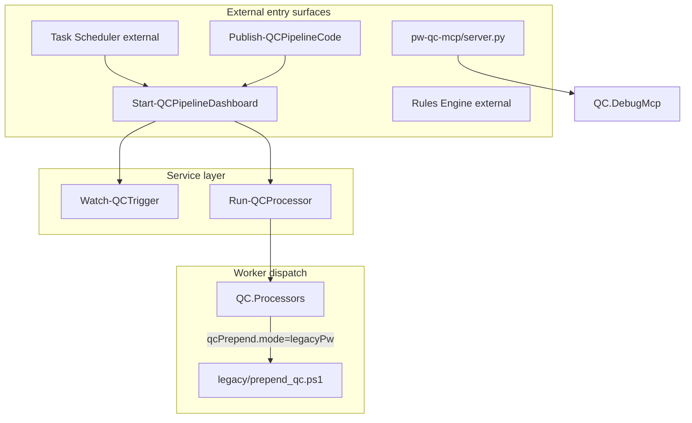
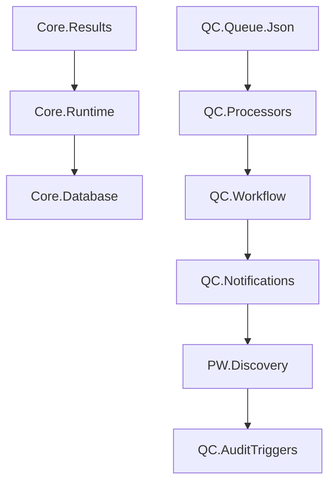

# Phase 4: Module and Script Organization Plan

**Branch:** `phase-4/module-script-organization-plan` (Phase 4A plan — do not merge to `dev` alone)  
**Integration branch:** `phase-4/integration` — base for Phases 4B–4H  
**Base:** `dev` @ `e344206`  
**Status:** Phase 4A complete (plan doc only). Implementation branches merge into `phase-4/integration`; `dev` is updated only after all Phase 4 phases are validated together.

## Context

Phases 1–3 cleanup is merged into `dev`:

- Obsolete in-memory `QC.Package*` model archived under `archive/package-model-v1/`.
- Dead `JobFactory` `metadata.package` dedupe branch removed ([`docs/phase-3-jobfactory-package-dedupe-decision.md`](phase-3-jobfactory-package-dedupe-decision.md)).
- SQL `sheet_packages` / `sheet_package_qc_pdfs` is the production-canonical package model.
- [`legacy/prepend_qc.ps1`](../legacy/prepend_qc.ps1) remains **production-relevant** while `qcPrepend.mode` is `legacyPw`.
- Native prepend in [`modules/QC.Processors.psm1`](../modules/QC.Processors.psm1) (`mode` = `local`) is local-file-only and has never been used in production.

Phase 4A delivers this document only. Implementation is split into Phases 4B–4H (Section 9).

---

## 1. Entry point inventory

### Classification legend

| Label | Meaning |
|-------|---------|
| **service** | Long-running pipeline component (dashboard, watcher, worker) |
| **scheduled-task** | Intended for Task Scheduler (none registered in-repo) |
| **rules-engine** | ProjectWise Rules Engine or external automation invocation |
| **deployment** | Publish, build, promote |
| **MCP** | Model Context Protocol debug server |
| **diagnostics** | Read-only probes, smoke tests, queue/PW inspection |
| **discovery** | Capability surveys and POC scripts |
| **maintenance** | Destructive or state-changing operator tools |
| **compatibility** | Root shims delegating to `scripts/` |
| **true-legacy** | Superseded monolithic entry points |
| **production-pw-prepend** | Active ProjectWise prepend implementation |

### Root shims (compatibility wrappers)

| Current path | Classification | Move risk | External dep risk | Wrapper needed |
|--------------|----------------|-----------|-------------------|----------------|
| [`Start-QCPipelineDashboard.ps1`](../Start-QCPipelineDashboard.ps1) | compatibility → service | High | Task Scheduler, operator habit, worker installs | **Keep** — silent delegate |
| [`Watch-QCTrigger.ps1`](../Watch-QCTrigger.ps1) | compatibility → service | High | Published by `Publish-QCPipelineCode` | **Keep** |
| [`Run-QCProcessor.ps1`](../Run-QCProcessor.ps1) | compatibility → service | High | Published by `Publish-QCPipelineCode` | **Keep** |
| [`run_prepend_qc.ps1`](../run_prepend_qc.ps1) | compatibility → service | Medium | Docs, `-Legacy` path | **Keep** |
| [`Testpwps.ps1`](../Testpwps.ps1) | diagnostics | Low | None | No |

### Service entry points

| Current path | Classification | Move risk | External dep risk | Wrapper needed |
|--------------|----------------|-----------|-------------------|----------------|
| [`scripts/Start-QCPipelineDashboard.ps1`](../scripts/Start-QCPipelineDashboard.ps1) | **service** (primary production entry) | **Critical** | Spawns watcher + worker pool; worker root copies | Yes at root + update `Publish-QCPipelineCode` |
| [`scripts/Watch-QCTrigger.ps1`](../scripts/Watch-QCTrigger.ps1) | **service** (enqueuer) | **Critical** | Published to worker; 20-module bootstrap | Yes at root + publish list |
| [`scripts/Run-QCProcessor.ps1`](../scripts/Run-QCProcessor.ps1) | **service** (worker) | **Critical** | Published to worker | Yes at root + publish list |
| [`scripts/run_prepend_qc.ps1`](../scripts/run_prepend_qc.ps1) | **service** (launcher) | Medium | `-Legacy` → `legacy/prepend_qc_on_trigger.ps1` | Root shim |
| [`scripts/Stop-QCPipeline.ps1`](../scripts/Stop-QCPipeline.ps1) | maintenance | Medium | Called by publish restart | Optional shim later |

**Proposed target:** `scripts/service/`

### Deployment

| Current path | Classification | Move risk | External dep risk | Wrapper needed |
|--------------|----------------|-----------|-------------------|----------------|
| [`scripts/Publish-QCPipelineCode.ps1`](../scripts/Publish-QCPipelineCode.ps1) | **deployment** | **Critical** | Hardcoded copy plan (modules + 5 scripts) | Update copy list before any script move |
| [`scripts/Promote-DevToMain.ps1`](../scripts/Promote-DevToMain.ps1) | deployment | Low | Git remote | No |
| [`scripts/Sync-OverlayReviewStamp.ps1`](../scripts/Sync-OverlayReviewStamp.ps1) | deployment | Low | PyInstaller bundle path | No |
| [`overlay/build_overlay_exe.ps1`](../overlay/build_overlay_exe.ps1) | deployment | Low | Build machine | No |

**Proposed target:** `scripts/deployment/`

### Production ProjectWise prepend

| Current path | Classification | Move risk | External dep risk | Wrapper needed |
|--------------|----------------|-----------|-------------------|----------------|
| [`legacy/prepend_qc.ps1`](../legacy/prepend_qc.ps1) | **production-pw-prepend** | **Critical** | Spawned by `Invoke-QCPrependProcessor` when `qcPrepend.mode=legacyPw`; `legacyScriptPath` override | **Yes** — one-release wrapper after move to `scripts/processing/Invoke-QCPrependPw.ps1` (Phase 4B) |

This is **not** obsolete legacy code. See Section 2.

### True legacy / alternate entry points

| Current path | Classification | Move risk | External dep risk | Wrapper needed |
|--------------|----------------|-----------|-------------------|----------------|
| [`legacy/prepend_qc_on_trigger.ps1`](../legacy/prepend_qc_on_trigger.ps1) | **true-legacy** | Low | `run_prepend_qc.ps1 -Legacy` only | Keep path or document deprecation |
| [`legacy/combine_status_set.ps1`](../legacy/combine_status_set.ps1) | compatibility fallback | Medium | Used when `statusSet.mode=legacy` (production uses `native`) | Wrapper if moved |
| [`legacy/run_combine_status_set.ps1`](../legacy/run_combine_status_set.ps1) | true-legacy | Low | Standalone launcher | No |
| [`legacy/Logging.ps1`](../legacy/Logging.ps1), [`StaMtaRelaunch.ps1`](../legacy/StaMtaRelaunch.ps1), [`Resolve-OverlayExe.ps1`](../legacy/Resolve-OverlayExe.ps1) | helpers (dot-sourced) | Medium | `QC.ReviewStamp`, prepend, tests | Keep under `legacy/` or `modules/Compatibility/` |

### Maintenance / operations

| Current path | Classification | Move risk | Wrapper |
|--------------|----------------|-----------|---------|
| [`scripts/Reset-QCFolderWorkflow.ps1`](../scripts/Reset-QCFolderWorkflow.ps1) | maintenance | **High** (in publish list) | Yes |
| [`scripts/Purge-QCPendingByFilters.ps1`](../scripts/Purge-QCPendingByFilters.ps1) | maintenance | Medium | Optional |
| [`scripts/Requeue-QCJobs.ps1`](../scripts/Requeue-QCJobs.ps1) | maintenance | Low | Optional |
| [`scripts/Repair-QCQueueDuplicates.ps1`](../scripts/Repair-QCQueueDuplicates.ps1) | maintenance | Low | Optional |
| [`scripts/Repair-QCDocumentsFolderPaths.ps1`](../scripts/Repair-QCDocumentsFolderPaths.ps1) | maintenance | Low | Optional |
| [`scripts/Invoke-QCDatabaseRetention.ps1`](../scripts/Invoke-QCDatabaseRetention.ps1) | maintenance | Low | Optional |
| [`scripts/Remove-QCAuditEvents.ps1`](../scripts/Remove-QCAuditEvents.ps1) | maintenance | Low | Optional |
| [`scripts/Remove-QCWorkflowEvents.ps1`](../scripts/Remove-QCWorkflowEvents.ps1) | maintenance | Low | Optional |
| [`scripts/Remove-LegacyQcPdfDatabaseRows.ps1`](../scripts/Remove-LegacyQcPdfDatabaseRows.ps1) | maintenance | Low | Optional |
| [`scripts/Remove-InvalidSheetIndexRows.ps1`](../scripts/Remove-InvalidSheetIndexRows.ps1) | maintenance | Low | Optional |
| [`scripts/Import-QCJsonlLogsToAutomationEvents.ps1`](../scripts/Import-QCJsonlLogsToAutomationEvents.ps1) | maintenance | Low | Optional |
| [`scripts/Sync-QCFolderSheetIndex.ps1`](../scripts/Sync-QCFolderSheetIndex.ps1) | maintenance | Medium | Optional |
| [`scripts/Refresh-SheetIndexStates.ps1`](../scripts/Refresh-SheetIndexStates.ps1) | maintenance | Medium | Optional |
| [`scripts/Reconcile-QCSheetOwnership.ps1`](../scripts/Reconcile-QCSheetOwnership.ps1) | maintenance | Medium | Optional |
| [`scripts/Reconcile-QCStatusSets.ps1`](../scripts/Reconcile-QCStatusSets.ps1) | maintenance | Medium | Optional |
| [`scripts/Sync-PWUserDirectory.ps1`](../scripts/Sync-PWUserDirectory.ps1) | maintenance | Medium | Optional |
| [`scripts/Combine-StatusSet.ps1`](../scripts/Combine-StatusSet.ps1) | processing | Medium | Optional |
| [`scripts/Run-CombineStatusSet.ps1`](../scripts/Run-CombineStatusSet.ps1) | processing | Low | Optional |

**Proposed target:** `scripts/maintenance/` and `scripts/processing/`

### Diagnostics (required minimum + full set)

| Current path | Classification | Move risk | Wrapper |
|--------------|----------------|-----------|---------|
| [`scripts/Get-PWFolderStateCounts.ps1`](../scripts/Get-PWFolderStateCounts.ps1) | diagnostics | Low | No |
| [`scripts/Scan-PWProjectMetrics.ps1`](../scripts/Scan-PWProjectMetrics.ps1) | diagnostics | Low | No |
| [`scripts/Show-QCStatus.ps1`](../scripts/Show-QCStatus.ps1) | diagnostics | Low | Optional |
| [`scripts/Show-QCQueueDiag.ps1`](../scripts/Show-QCQueueDiag.ps1) | diagnostics | Low | Optional |
| [`scripts/PW-BrowseFolder.ps1`](../scripts/PW-BrowseFolder.ps1) | diagnostics | Low | No |
| [`scripts/PW-ListDocsInFolder.ps1`](../scripts/PW-ListDocsInFolder.ps1) | diagnostics | Low | No |
| [`scripts/PW-TestWatchRoots.ps1`](../scripts/PW-TestWatchRoots.ps1) | diagnostics | Low | No |
| [`scripts/PW-SmokeTest.ps1`](../scripts/PW-SmokeTest.ps1) | diagnostics | Low | No |
| [`scripts/Test-PWConnection.ps1`](../scripts/Test-PWConnection.ps1) | diagnostics | Low | No |
| [`scripts/Test-PWDocumentStateChange.ps1`](../scripts/Test-PWDocumentStateChange.ps1) | diagnostics | Low | No |
| [`scripts/Test-PWEmailAttributes*.ps1`](../scripts/) (11 scripts) | diagnostics | Low | No |
| [`scripts/Test-QCEmailTemplate.ps1`](../scripts/Test-QCEmailTemplate.ps1) | diagnostics | Low | No |
| [`scripts/Test-QCNotificationGraph.ps1`](../scripts/Test-QCNotificationGraph.ps1) | diagnostics | Low | No |
| [`scripts/Test-QCWatcherSessionAlert.ps1`](../scripts/Test-QCWatcherSessionAlert.ps1) | diagnostics | Low | No |
| [`legacy/verify_pw_columns.ps1`](../legacy/verify_pw_columns.ps1) | diagnostics | Low | No |
| [`legacy/test_project_id_from_workarea.ps1`](../legacy/test_project_id_from_workarea.ps1) | diagnostics | Low | No |

**Proposed target:** `scripts/diagnostics/`

### Discovery

| Current path | Classification | Move risk | Wrapper |
|--------------|----------------|-----------|---------|
| [`tools/discovery/*.ps1`](../tools/discovery/) (16 scripts) | discovery | Low | Optional merge into `scripts/discovery/` |

### MCP entry points

| Current path | Classification | Move risk | External dep risk | Wrapper |
|--------------|----------------|-----------|-------------------|---------|
| `tools/pw-qc-mcp/server.py` | **MCP** (primary) | Medium | `.cursor/mcp.json`, Cursor MCP config | No move in Phase 4 |
| `tools/pw-qc-mcp/pw_qc_worker.ps1` | MCP backend | Medium | Imports `QC.DebugMcp.psm1` | No |
| `tools/pw-qc-mcp/server.ps1` | MCP alternate | Low | Local dev | No |
| `tools/pw-qc-mcp/run_server.ps1`, `run_server.cmd` | MCP launcher | Low | `%LOCALAPPDATA%` copy | No |

MCP tools: `search_sheet`, `get_sheet_identity`, `get_sheet_package_members`, `get_sheet_debug_timeline`, `get_notification_diagnostics`, `get_data_integrity_report`, `get_qc_process_type_diagnostics`, `warm_projectwise_session`, `compare_projectwise_to_database`, `get_recent_errors`, `get_process_health`, `get_audit_scan_history`, `get_job_timeline`, `get_document_debug_events`, `get_package_debug_events`.

### Internal helper (not an external entry point)

| Current path | Classification |
|--------------|----------------|
| [`scripts/Import-QCScriptModules.ps1`](../scripts/Import-QCScriptModules.ps1) | helper — dot-sourced DB maintenance bootstrap |

### Scheduled tasks and Rules Engine

No `Register-ScheduledTask` or `schtasks` references exist in-repo. **Before any move**, audit worker servers and ProjectWise Rules Engine for hardcoded paths (Section 8).

### Architecture diagram



---

## 2. ProjectWise prepend reclassification

### Production truth

| Statement | Detail |
|-----------|--------|
| **`legacy/prepend_qc.ps1` is production PW prepend** | Full PW export → overlay/qpdf merge → lane PDF upload → attribute sync. Not dead code. |
| **`qcPrepend.mode: legacyPw` routes production jobs** | Committed [`appsettings.json`](../appsettings.json) line 229. `Invoke-QCPrependProcessor` compares mode case-insensitively to `legacypw`. |
| **Native/local prepend is not production-ready** | `mode` = `local` (code default if absent) runs in-process file I/O only — no PW export/import. See [`docs/phase-2-native-prepend-parity-plan.md`](phase-2-native-prepend-parity-plan.md). |

### Routing chain

```
QC_PREPEND job (queue)
  → Run-QCProcessor.ps1
  → Invoke-QCPrependProcessor (QC.Processors.psm1)
      ├─ mode = legacyPw → child: powershell.exe -MTA -File legacy\prepend_qc.ps1
      └─ mode = local    → in-process native path (requires local PDF on disk)
```

Processor dispatch is mode-agnostic: `processors.processorMap.QC_PREPEND` → `Invoke-QCPrependProcessor`.

Legacy spawn (configurable via `qcPrepend.legacyScriptPath`):

```powershell
# QC.Processors.psm1 ~1347
$legacyPrepend = if ($qc.legacyScriptPath) { $qc.legacyScriptPath } else { Join-Path $repoRoot 'legacy\prepend_qc.ps1' }
```

### Reference index

| Search term | Key locations |
|-------------|---------------|
| `legacy/prepend_qc.ps1` | `QC.Processors.psm1:1344-1568`, [`legacy/README.md`](../legacy/README.md), `test/test_qc_prepend_processor.ps1`, `test/test_qc_prepend_lane_resolution.ps1` |
| `qcPrepend.mode` | `appsettings.json:229`, `QC.Processors.psm1:1338-1345`, `docs/appsettings-reference.md` |
| `legacyPw` | `if ($mode -eq 'legacypw')` in `QC.Processors.psm1` |
| Native prepend | `QC.Processors.psm1:1571+`, `docs/phase-2-native-prepend-parity-plan.md` |
| `local` mode | Code default `$mode = 'local'`; phrase "local prepend" not used in repo |
| `legacyScriptPath` | `qcPrepend.legacyScriptPath` override in processor |
| Alternate entry | `scripts/run_prepend_qc.ps1 -Legacy` → `legacy/prepend_qc_on_trigger.ps1` |

### Status-set legacy (related, not prepend)

| Job type | Config | Legacy script | Production |
|----------|--------|---------------|------------|
| `QC_PREPEND` | `qcPrepend.mode = legacyPw` | `legacy/prepend_qc.ps1` | **Yes** |
| `STATUS_SET_GEN` | `statusSet.mode = legacy` | `legacy/combine_status_set.ps1` | **No** (`statusSet.mode = native`) |

### Recommended future naming (Phase 4B — do not implement in 4A)

| Item | Current | Proposed |
|------|---------|----------|
| Script | `legacy/prepend_qc.ps1` | `scripts/processing/Invoke-QCPrependPw.ps1` |
| Config mode | `legacyPw` | `projectWise` or `pw` (preferred) |
| Compatibility | — | `legacyPw` remains accepted alias |
| Old path | — | `legacy/prepend_qc.ps1` → thin wrapper with **warning** for one release cycle |

---

## 3. Module inventory and proposed target folders

**Active modules:** 41 `modules/*.psm1` files (synced with [`modules/FILES.md`](../modules/FILES.md) as of Phase 4A baseline).  
**Archived:** 5 `QC.Package*` modules under `archive/package-model-v1/modules/` only.

**Target tree:**

```
modules/Core/           — Core.Results, Runtime, Paths, Config, Logging, Hashing, Telemetry, WatcherOrchestration
modules/Database/       — Core.Database
modules/ProjectWise/    — PW.Connection, Discovery, AuditPoller, Users
modules/Workflow/       — QC.Workflow, AuditTriggers, ProcessType
modules/Queue/          — QC.Queue.Json, JobFactory, Worker, Filters, Triggers
modules/Processing/     — QC.Processors, StatusSet, Rendition, ReviewStamp, PdfExport, Comment* (7)
modules/Notifications/  — QC.Notifications, Notification*, WatcherAlerts
modules/Reporting/      — QC.Reporting
modules/Diagnostics/    — QC.DebugMcp
modules/Compatibility/  — future shims only (not long-term home for package model)
```

**Convention:** Preserve `.psm1` filenames inside subfolders. Do not rename modules in Phase 4E.

### Wildcard export modules (`Export-ModuleMember -Function *`)

`Core.Config`, `Core.Results`, `Core.Runtime`, `Core.Paths`, `Core.Hashing`, `Core.Logging`, `QC.Filters`, `QC.Triggers`, `QC.JobFactory`, `QC.Queue.Json`, `QC.Processors`, `QC.Rendition`, `QC.Worker`, `PW.Discovery`

### Per-module summary

| Module | Exports | Import-Module deps | Dot-source | PW | SQL | Graph | Safe w/o PWPS_DAB | Known callers | Target folder | Confidence |
|--------|---------|-------------------|------------|-----|-----|-------|-------------------|---------------|---------------|------------|
| `Core.Results` | `*` (5 fn) | — | — | — | — | — | **Yes** | All modules | Core | High |
| `Core.Runtime` | `*` (23 fn) | Core.Results | — | — | — | — | **Yes** | Watcher, worker, most scripts | Core | High |
| `Core.Paths` | `*` (5 fn) | Core.Results | — | — | — | — | **Yes** | Queue, filters, JobFactory | Core | High |
| `Core.Config` | `*` (4 fn) | Results, Runtime | — | validates PW config | — | — | **Yes** | Dashboard, notifications | Core | High |
| `Core.Logging` | `*` (2 fn) | — | — | — | — | — | **Yes** | Workflow, ProcessType | Core | High |
| `Core.Hashing` | `*` (2 fn) | — | — | — | — | — | **Yes** | Watcher, CommentStatusProcessor | Core | High |
| `Core.Telemetry` | explicit (6 fn) | Core.Results; lazy Database | — | — | automation_events | — | **Yes** | Watcher, worker | Core | High |
| `Core.Database` | explicit (40+ fn) | Results, Runtime, Paths | — | optional cmdlet sync | **Primary SQL** | — | **Yes** | Watcher, worker, maintenance scripts | Database | High |
| `PW.Connection` | explicit (14 fn) | Core.Results | — | **pwps_dab** | — | — | **No** | Watcher, StatusSet, Rendition, DebugMcp | ProjectWise | High |
| `PW.Discovery` | `*` (~100 fn) | Runtime, AuditTriggers, ProcessType | — | **Heavy PW** | optional sheet_index | — | **No** | Watcher, Workflow, Notifications | ProjectWise | High |
| `PW.AuditPoller` | explicit (22 fn) | *caller must preload Core + ProcessType* | — | Select-PWSQL, cmdlets | watermarks | — | **No** | Watcher, discovery tools | ProjectWise | High |
| `PW.Users` | `Sync-PWUserDirectory` | — | — | Select-PWSQL | via Database caller | — | **No** | Watcher, Sync-PWUserDirectory.ps1 | ProjectWise | High |
| `QC.Queue.Json` | `*` (~45 fn) | Results, Runtime, Paths | — | — | — | — | **Yes** | Watcher, worker, dashboard | Queue | High |
| `QC.JobFactory` | `*` (9 fn) | Results, Runtime, Paths | — | — | — | — | **Yes** | Watcher | Queue | High |
| `QC.Worker` | `*` (1 fn) | — (implicit Queue.Json) | — | — | — | — | **Yes** | Run-QCProcessor | Queue | High |
| `QC.Filters` | `*` (1+ fn) | Results, Paths | — | — | — | — | **Yes** | Watcher, Purge-QCPendingByFilters | Queue | High |
| `QC.Triggers` | `*` (6 fn) | Results, Paths, ProcessType | — | — | — | — | **Yes** | Watcher | Queue | High |
| `QC.ProcessType` | explicit (18 fn) | Runtime, Logging | — | search cmdlets | — | — | **No** | Watcher, Discovery, AuditTriggers | Workflow | High |
| `QC.AuditTriggers` | explicit (28 fn) | Results, ProcessType; lazy Database | — | — | queries | — | Partial | Workflow, Discovery, Processors | Workflow | High |
| `QC.Workflow` | explicit (22 fn) | Results, Runtime, Logging, Notifications, AuditTriggers, ProcessType, Discovery | — | **PW writes** | indirect | via Notifications | **No** | Watcher, Processors, comment sync | Workflow | High |
| `QC.Processors` | `*` (~56 fn) | Results, Runtime, Workflow, Reporting, CommentStatusProcessor, ReviewStamp, ProcessType, Rendition, AuditTriggers | — | via chain + legacy spawn | optional | via chain | **No** | Run-QCProcessor | Processing | High |
| `QC.StatusSet` | explicit (21 fn) | Results, Paths, Runtime, PW.Connection | — | **PW export/write** | — | — | **No** | Watcher, Combine-StatusSet | Processing | High |
| `QC.Rendition` | `*` (16 fn) | Results, Runtime, PW.Connection; conditional Discovery, ProcessType, Queue.Json | — | **PW rendition** | — | — | **No** | Run-QCProcessor | Processing | High |
| `QC.ReviewStamp` | explicit (7 fn) | — | `legacy/Resolve-OverlayExe.ps1` at runtime | — | — | — | **Yes** | Processors | Processing | High |
| `QC.PdfExport` | explicit (4 fn) | Results, StatusSet | — | PW download | — | — | **No** | Comment sync chain | Processing | High |
| `QC.CommentExtract` | explicit (3 fn) | Results, PdfExport | — | — | — | — | Partial | CommentStatusProcessor | Processing | High |
| `QC.CommentStatusDecision` | explicit (4 fn) | Results | — | — | — | — | **Yes** | CommentStatusProcessor | Processing | High |
| `QC.CommentSync.Job` | explicit (3 fn) | Results, PdfExport, PW.Connection, Discovery | — | PW metadata | — | — | **No** | CommentStatusProcessor | Processing | High |
| `QC.CommentSync.State` | explicit (2 fn) | Results, Workflow, PdfExport | — | PW state | — | — | **No** | CommentStatusProcessor | Processing | High |
| `QC.CommentSync.Database` | explicit (7 fn) | Results, Database, PdfExport, AuditTriggers | — | — | **SQL** | — | Partial | CommentStatusProcessor | Processing | High |
| `QC.CommentSync.Notifications` | explicit (2 fn) | Results, PdfExport, CommentStatusDecision, Notifications | — | — | — | Graph via Notifications | Partial | CommentStatusProcessor | Processing | High |
| `QC.CommentStatusProcessor` | explicit (2 fn) | Full comment-sync stack (12 modules) | — | PW | SQL | Graph | **No** | Processors | Processing | High |
| `QC.Notifications` | explicit (30+ fn) | Results, Runtime, Config, NotificationTemplates/Mock/Graph/Threads, ProcessType; conditional Discovery | — | optional | dedupe tables | **Graph** | Partial | Watcher, worker | Notifications | High |
| `QC.NotificationGraph` | explicit | Results, Runtime | — | — | — | **Graph API** | **Yes** | Notifications, WatcherAlerts | Notifications | High |
| `QC.NotificationMock` | explicit | Results, Runtime | — | — | — | — | **Yes** | Notifications | Notifications | High |
| `QC.NotificationTemplates` | explicit | Runtime, Config | — | optional Discovery | — | — | **Yes** | Notifications | Notifications | High |
| `QC.NotificationThreads` | explicit | Results, Runtime | — | — | thread tables | — | Partial | Notifications | Notifications | High |
| `QC.WatcherAlerts` | explicit (7 fn) | Results, Runtime, NotificationGraph | — | — | — | Graph/mock | Partial | Watcher, dashboard | Notifications | High |
| `QC.WatcherOrchestration` | explicit (24 fn) | Results, Runtime; lazy Workflow | — | — | Scalar queries | — | Partial | Watcher, dashboard | Core | Medium |
| `QC.Reporting` | explicit (10 fn) | Results, Runtime | — | — | queries | — | Partial | Processors | Reporting | High |
| `QC.DebugMcp` | explicit (16 fn) | Core.*, PW.Connection, Discovery, ProcessType | — | PW reads | SQL diagnostics | — | **No** | MCP worker, tests only | Diagnostics | High |

**`QC.WatcherOrchestration` placement note:** Used by production watcher and dashboard, not operator diagnostics. Prefer `modules/Core/` over `Diagnostics/` to avoid implying optional load.

---

## 4. Import graph and anti-patterns

### Module-to-module hub

`Core.Results` → ~40 dependents. No static `Import-Module` cycles; session export clobber on PS 5.1 is the main runtime hazard.

### Production load orders (must stay synchronized across future moves)

| Entry | Module load mechanism |
|-------|----------------------|
| [`scripts/Watch-QCTrigger.ps1`](../scripts/Watch-QCTrigger.ps1) | `$script:WatchModuleLoadOrder` (20 modules) + `$script:WatchModuleRestoreOrder` + `$script:WatchRequiredCommands` |
| [`scripts/Run-QCProcessor.ps1`](../scripts/Run-QCProcessor.ps1) | 9 direct imports + re-import guards for Database/Runtime |
| [`scripts/Start-QCPipelineDashboard.ps1`](../scripts/Start-QCPipelineDashboard.ps1) | Results, Runtime, Config, Queue.Json, WatcherOrchestration, WatcherAlerts |
| [`scripts/Import-QCScriptModules.ps1`](../scripts/Import-QCScriptModules.ps1) | Results → Database → Runtime + session proxies |
| [`.cursor/rules/module-imports.mdc`](../.cursor/rules/module-imports.mdc) | Canonical guidance |

**Watcher load order:**

```
Core.Results → Core.Paths → Core.Runtime → Core.Hashing → Core.Database
→ QC.Filters → QC.Triggers → QC.JobFactory → QC.Queue.Json → QC.Notifications
→ QC.Workflow → QC.Rendition → QC.Processors → QC.WatcherOrchestration
→ QC.StatusSet → QC.ProcessType → PW.Connection → PW.Users → PW.Discovery → PW.AuditPoller
```

### Script-to-module pattern

Preferred: `Join-Path $repoRoot 'modules\ModuleName.psm1'`

**Inconsistent paths:**

- `scripts/Show-QCQueueDiag.ps1`, `scripts/Requeue-QCJobs.ps1` — `$PSScriptRoot/../modules`
- Some tests — `$PSScriptRoot/../modules` (acceptable for tests; document in Phase 4F)

### Anti-patterns flagged

| Issue | Severity | Detail |
|-------|----------|--------|
| PS 5.1 export clobber | **High** | Nested `Import-Module -Force` hides session commands; watcher `_Watch-RestoreFoundationModules` |
| Wildcard exports on large modules | **High** | `PW.Discovery`, `QC.Processors`, `QC.Queue.Json` export private helpers |
| Import-time conditional loading | Medium | `QC.Workflow` ↔ `QC.Notifications` ↔ `PW.Discovery` |
| Import-time stub functions | Medium | `QC.Notifications` defines `Test-QCDatabaseEnabled` if Database not loaded |
| Implicit dependencies | Medium | `QC.Worker` needs `QC.Queue.Json`; `PW.AuditPoller` needs caller-preloaded Core stack |
| Duplicated load-order arrays | Medium | Watcher, `test_watcher_module_bootstrap`, `test_watch_foundation_restore`, `Import-QCScriptModules` |
| Production → legacy hardcoded paths | **High** | `QC.Processors` spawns `legacy\prepend_qc.ps1`, `legacy\combine_status_set.ps1` |
| Production importing diagnostics | **None** | `QC.DebugMcp` isolated to MCP + tests |
| Deep static import chains | Medium | `QC.CommentStatusProcessor` → 12 modules; `QC.Processors` pulls half the repo |
| Modules importing legacy at load | **None** | `QC.ReviewStamp` dots `legacy/Resolve-OverlayExe.ps1` at runtime only |



---

## 5. Script organization plan

### Proposed folders

| Folder | Purpose |
|--------|---------|
| `scripts/service/` | Dashboard, watcher, worker, run_prepend_qc, Stop-QCPipeline |
| `scripts/processing/` | Combine-StatusSet, Run-CombineStatusSet, future Invoke-QCPrependPw |
| `scripts/deployment/` | Publish-QCPipelineCode, Promote-DevToMain, Sync-OverlayReviewStamp |
| `scripts/maintenance/` | Reset, Purge, Requeue, Repair-*, Remove-*, retention, sync/reconcile |
| `scripts/diagnostics/` | Get-PW*, Scan-*, Show-*, PW-Browse*, Test-PW*, Test-QC* |
| `scripts/discovery/` | Optional home for `tools/discovery/*` |

### Move priority and risk

| Priority | Scripts | Risk | Server / scheduled-task check |
|----------|---------|------|-------------------------------|
| P0 — never move without publish update | Watch, Run, Start dashboard, Import-QCScriptModules, Reset | **Critical** | Worker install + Task Scheduler |
| P1 — production spawn path | `legacy/prepend_qc.ps1` | **Critical** | Phase 4B only with wrapper |
| P2 — maintenance | Purge, Repair, Remove, Sync scripts | Medium | Operator runbooks |
| P3 — diagnostics | Get-PWFolderStateCounts, Scan-PWProjectMetrics, Test-* | Low | MCP may invoke metrics scripts |
| P4 — discovery | `tools/discovery/*` | Low | Dev/ops only |

`tools/discovery/` and `test/inspect_*.ps1` remain valid during transition; operator diagnostics under `test/` are not production entry points.

---

## 6. Compatibility shim strategy

### Module shims (Phase 4E)

Silent forward at the flat path (no warnings in this phase):

```powershell
# modules/QC.Queue.Json.psm1 — compatibility shim (remove Phase 4H)
$ErrorActionPreference = 'Stop'
$target = Join-Path $PSScriptRoot 'Queue\QC.Queue.Json.psm1'
if (-not (Test-Path -LiteralPath $target)) {
    throw "Module implementation not found: $target"
}
Import-Module $target -Force -Global
```

### Script shims

Root shims already delegate silently — **no warnings**:

```powershell
& (Join-Path $PSScriptRoot 'scripts\Start-QCPipelineDashboard.ps1') @args
```

After move to `scripts/service/`, update inner target; keep root shim unchanged.

### Prepend wrapper (Phase 4B)

```powershell
# legacy/prepend_qc.ps1 — one release cycle
Write-Warning 'legacy/prepend_qc.ps1 is deprecated; use scripts/processing/Invoke-QCPrependPw.ps1'
& (Join-Path $PSScriptRoot '..\scripts\processing\Invoke-QCPrependPw.ps1') @PSBoundParameters
```

### Warning policy

| Wrapper | Emit warning? |
|---------|---------------|
| Root script shims (existing) | **No** |
| Moved module shims at old flat path | **Yes** — once per session |
| `legacy/prepend_qc.ps1` after promotion | **Yes** — every invocation |
| `legacy/combine_status_set.ps1` if moved | **Yes** when `statusSet.mode=legacy` |
| Test harness imports | **No** |

---

## 7. `.psd1` manifest strategy (plan only — do not create in Phase 4)

### Sequence

1. **Phase 4E:** Folder moves + flat-path shims (no manifests).
2. **Phase 4G:** Introduce manifests after imports stabilized in 4F.

### Proposed packages

| Manifest | Modules | PWPS_DAB isolation |
|----------|---------|-------------------|
| `QC.Core.psd1` | Core.* except Database; include WatcherOrchestration | No PW |
| `QC.Database.psd1` | Core.Database | SQL only; document soft PW dep for lane sync |
| `QC.ProjectWise.psd1` | PW.* | Requires pwps_dab at runtime |
| `QC.Workflow.psd1` | Workflow, AuditTriggers, ProcessType | PW |
| `QC.Queue.psd1` | Queue.Json, JobFactory, Worker, Filters, Triggers | No PW |
| `QC.Processing.psd1` | Processors, StatusSet, Rendition, ReviewStamp, PdfExport, Comment* | PW |
| `QC.Notifications.psd1` | Notifications, Notification*, WatcherAlerts | Graph optional |
| `QC.Diagnostics.psd1` | DebugMcp | PW + SQL; never imported by service scripts |

### Rules

- Replace `Export-ModuleMember -Function *` with explicit `FunctionsToExport` per manifest.
- Use `PrivateData.PSData` semver aligned with pipeline releases.
- Service scripts eventually: `Import-Module QC.Queue` instead of 14 individual imports.
- **Never** import `QC.ProjectWise` from PW-free maintenance paths.
- Nested manifests may re-export subsets; avoid circular `RequiredModules`.

---

## 8. External dependency checklist

Inspect before any file move:

| System | What to check |
|--------|---------------|
| **Task Scheduler** | Actions pointing to root shims or `scripts\*.ps1` on worker machines |
| **ProjectWise Rules Engine** | Rules invoking `legacy\` or `scripts\` paths |
| **MCP config** | `.cursor/mcp.json` → `tools/pw-qc-mcp/server.py`; worker repo root assumptions |
| **Publish-QCPipelineCode** | Copy plan: `modules/`, Watch, Run, Import-QCScriptModules, Start dashboard, Reset |
| **appsettings.local / secrets** | `qcPrepend.legacyScriptPath`, `statusSet.legacyScriptPath` overrides |
| **Power BI / reporting** | Consumers of `Scan-PWProjectMetrics`, SQL connection strings |
| **Operator docs** | `docs/`, `modules/README.md`, `legacy/README.md`, runbooks |
| **Tests / hardcoded paths** | `test/*` using `../modules`, `legacy\`; `run_focus_tests.ps1` script list |
| **Worker install layout** | Per-site roots (e.g. `D:\QC_Pipeline\Prepend PDF QC`) |
| **Overlay build** | `dist\qc_overlay_prepend\qc_overlay_prepend.exe` path in prepend and ReviewStamp |

---

## 9. Staged implementation plan

### Integration branch workflow

```text
dev (untouched until Phase 4 complete)
 └── phase-4/module-script-organization-plan   (4A — plan doc; do not merge to dev alone)
      └── phase-4/integration                    (integration base for 4B–4H)
           ├── phase-4/prepend-path-promotion   (4B) ──merge──► integration
           ├── phase-4/diagnostics-scripts      (4C) ──merge──► integration
           ├── phase-4/maintenance-scripts      (4D) ──merge──► integration
           ├── phase-4/module-folders            (4E) ──merge──► integration
           ├── phase-4/import-updates            (4F) ──merge──► integration
           ├── phase-4/psd1-manifests            (4G) ──merge──► integration
           └── phase-4/shim-removal               (4H) ──merge──► integration
                                                    └──► dev (single merge after full validation)
```

**Rules:**

- Create each implementation branch from `phase-4/integration` (rebase or merge integration before starting the next phase).
- Merge each validated implementation branch back into `phase-4/integration` — not into `dev`.
- Do **not** merge `phase-4/module-script-organization-plan` or partial Phase 4 work into `dev`.
- Merge `phase-4/integration` into `dev` only after Phases 4B–4H are complete and validated together on the integration branch.

| Phase | Branch | Scope | Risk | Validation | Rollback | Stop condition |
|-------|--------|-------|------|------------|----------|----------------|
| **4A** | `phase-4/module-script-organization-plan` | This plan doc only | None | Baseline tests (Appendix A) | Delete branch | N/A |
| **4B** | `phase-4/prepend-path-promotion` | **Complete** — Move prepend to `scripts/processing/Invoke-QCPrependPw.ps1`; wrapper at `legacy/prepend_qc.ps1`; `projectWise`/`pw` mode aliases | **High** | `test_qc_prepend_processor.ps1`, `test_qc_prepend_lane_resolution.ps1`, pytest, focus suite | Revert mode + path | QC_PREPEND failure in staging |
| **4C** | `phase-4/diagnostics-scripts` | **Complete** — Move Show/Get/Scan/Test scripts to `scripts/diagnostics/`; silent wrappers at old `scripts/*.ps1` paths | Low | focus tests, wrapper test, MCP smoke | Shims at old paths | Broken diagnostic workflows |
| **4D** | `phase-4/maintenance-scripts` | **Complete** — Move Reset/Purge/Repair/Remove/Sync/Reconcile maintenance scripts to `scripts/maintenance/`; silent wrappers at old paths | Medium | focus tests, maintenance wrapper test | Shims at old paths | Publish copy list broken |
| **4E** | `phase-4/module-folders` | **Complete** — Move 41 modules into responsibility subfolders; flat `modules/*.psm1` shims; internal imports via flat shim paths | **High** | inventory, bootstrap, focus, module folder shim test | Shims at old paths | Bootstrap or inventory fail |
| **4F** | `phase-4/import-updates` | Update all Import-Module paths; Publish; add `test_entrypoint_imports.ps1` | **High** | full suite + new entrypoint test | Revert + shims | Production entry import failure |
| **4G** | `phase-4/psd1-manifests` | Add `.psd1`; narrow exports | Medium | manifest parse, PW-free import tests | Keep shims | PW leakage into Core |
| **4H** | `phase-4/shim-removal` | Remove shims after server validation | **Critical** | 1-week production soak, external path audit | Re-add shims | External caller still hits old path |

---

## 10. Validation and rollback

### Phase 4A validation commands

```powershell
python -m pytest tests/ -q
./test/run_focus_tests.ps1
./test/test_module_inventory.ps1
./test/test_watcher_module_bootstrap.ps1
```

### Future test: `test/test_entrypoint_imports.ps1` (Phase 4F)

- Import each production entry script's module load order without executing pipeline side effects.
- Assert required commands exist after import (`Test-QCDatabaseEnabled`, `Get-NextQCJob`, `Write-QCJsonLog`, etc.).
- Assert `QC.DebugMcp` commands are **not** loaded by watcher/processor bootstrap.
- Add to `run_focus_tests.ps1` after Phase 4F.

### Rollback principle

Every move branch ships with shims at old paths. Shims are removed only in Phase 4H after external dependency audit and production soak.

### Focus suite gap (documented debt)

`test_module_inventory.ps1` is not in `run_focus_tests.ps1`. Consider adding after Phase 4E when folder shims exist.

---

## Appendix A — Phase 4A baseline test results

Recorded on branch `phase-4/module-script-organization-plan` from `dev` @ `e344206`, clean working tree.

| Command | Result |
|---------|--------|
| `python -m pytest tests/ -q` | **PASS** — 86 passed, 3 skipped in ~8s |
| `./test/test_module_inventory.ps1` | **PASS** — 41 modules synced with `modules/FILES.md` |
| `./test/test_watcher_module_bootstrap.ps1` | **PASS** |
| `./test/run_focus_tests.ps1` | **PASS** — 21/21 tests |

Post-doc validation: re-run the same four commands and record in PR description when opening Phase 4A PR.

---

## Appendix C — Phase 4B prepend path promotion (complete)

**Branch:** `phase-4/prepend-path-promotion` → merge into `phase-4/integration` after review.

### Changes

| Item | Before | After |
|------|--------|-------|
| Production PW prepend script | `legacy/prepend_qc.ps1` (monolith) | `scripts/processing/Invoke-QCPrependPw.ps1` |
| `legacy/prepend_qc.ps1` | Production implementation | Deprecated shim (warns + forwards) |
| Default processor script path | `legacy\prepend_qc.ps1` | `scripts\processing\Invoke-QCPrependPw.ps1` |
| `qcPrepend.mode` values | `legacyPw`, `local` | `projectWise`, `pw`, `legacyPw` (alias), `local` |
| Config script override | `legacyScriptPath` | `projectWiseScriptPath` (preferred), `legacyScriptPath` (alias) |
| `appsettings.json` mode | `legacyPw` (unchanged) | Still `legacyPw` — no production config flip |

### Validation (Phase 4B)

| Command | Result |
|---------|--------|
| `python -m pytest tests/ -q` | **PASS** — 86 passed, 3 skipped |
| `./test/test_qc_prepend_lane_resolution.ps1` | **PASS** |
| `./test/run_focus_tests.ps1` | **PASS** — 21/21 |
| `./test/test_qc_prepend_processor.ps1` | **FAIL** — overlay 3-step qpdf page-count test (`qpdf` exit with warnings on reconstructed xref; unrelated to path move) |

### Rollback

Set `qcPrepend.legacyScriptPath` to a saved copy of the pre-4B script, or revert the branch. `legacyPw` mode continues to work via the shim.

---

## Appendix D — Phase 4C diagnostics script move (complete)

**Branch:** `phase-4/diagnostics-scripts` → merge into `phase-4/integration` after review.

**Summary doc:** [`docs/phase-4-diagnostics-script-move-summary.md`](phase-4-diagnostics-script-move-summary.md)

### Moved to `scripts/diagnostics/` (23 scripts)

`Get-PWFolderStateCounts`, `Scan-PWProjectMetrics`, `Show-QCStatus`, `Show-QCQueueDiag`, `PW-BrowseFolder`, `PW-ListDocsInFolder`, `PW-TestWatchRoots`, `PW-SmokeTest`, `Test-PWConnection`, `Test-PWDocumentStateChange`, `Test-PWEmailAttributes` (+ 9 `Test-PWEmailAttributes-*` variants), `Test-QCEmailTemplate`, `Test-QCNotificationGraph`, `Test-QCWatcherSessionAlert`.

### Wrappers retained

Silent compatibility wrappers at former `scripts/<name>.ps1` paths forward `@args` and `exit $LASTEXITCODE` to `scripts/diagnostics/<name>.ps1`.

### Intentionally deferred

- `tools/discovery/*.ps1` — docs, cross-script references, and MCP-adjacent paths still pin `tools/discovery/`; left unchanged.
- Service, deployment, maintenance, processing, and prepend scripts (forbidden list in Phase 4C scope).

### Validation

| Command | Result |
|---------|--------|
| `python -m pytest tests/ -q` | **PASS** — 86 passed, 3 skipped |
| `./test/run_focus_tests.ps1` | **PASS** — 21/21 |
| `./test/test_module_inventory.ps1` | **PASS** — 41 modules |
| `./test/test_watcher_module_bootstrap.ps1` | **PASS** |
| `./test/test_diagnostic_script_wrappers.ps1` | **PASS** — 23/23 (new) |

---

## Appendix E — Phase 4D maintenance script move (complete)

**Branch:** `phase-4/maintenance-scripts` → merge into `phase-4/integration` after review.

**Summary doc:** [`docs/phase-4-maintenance-script-move-summary.md`](phase-4-maintenance-script-move-summary.md)

### Moved to `scripts/maintenance/` (16 scripts)

`Reset-QCFolderWorkflow`, `Purge-QCPendingByFilters`, `Requeue-QCJobs`, `Repair-QCQueueDuplicates`, `Repair-QCDocumentsFolderPaths`, `Invoke-QCDatabaseRetention`, `Remove-QCAuditEvents`, `Remove-QCWorkflowEvents`, `Remove-LegacyQcPdfDatabaseRows`, `Remove-InvalidSheetIndexRows`, `Import-QCJsonlLogsToAutomationEvents`, `Sync-QCFolderSheetIndex`, `Refresh-SheetIndexStates`, `Reconcile-QCSheetOwnership`, `Reconcile-QCStatusSets`, `Sync-PWUserDirectory`.

### Wrappers retained

Silent compatibility wrappers at former `scripts/<name>.ps1` paths forward `@args` and `exit $LASTEXITCODE` to `scripts/maintenance/<name>.ps1`. `Publish-QCPipelineCode.ps1` unchanged — still copies `scripts\Reset-QCFolderWorkflow.ps1` (wrapper).

### Intentionally deferred

- `scripts/Import-QCScriptModules.ps1` — dot-sourced helper stays in `scripts/`
- `scripts/Stop-QCPipeline.ps1` — pipeline stop helper, not maintenance entry
- Processing, service, deployment, diagnostics, discovery, prepend scripts

### Validation

| Command | Result |
|---------|--------|
| `python -m pytest tests/ -q` | **PASS** — 86 passed, 3 skipped |
| `./test/run_focus_tests.ps1` | **PASS** — 21/21 |
| `./test/test_module_inventory.ps1` | **PASS** — 41 modules |
| `./test/test_watcher_module_bootstrap.ps1` | **PASS** |
| `./test/test_diagnostic_script_wrappers.ps1` | **PASS** — 23/23 |
| `./test/test_maintenance_script_wrappers.ps1` | **PASS** — 16/16 (new) |

---

## Appendix F — Phase 4E module folder move (complete)

**Branch:** `phase-4/module-folders` → merge into `phase-4/integration` after review.

**Summary doc:** [`docs/phase-4-module-folder-move-summary.md`](phase-4-module-folder-move-summary.md)

### Moved modules (41)

Implementations under `modules/Core/` (8), `Database/` (1), `ProjectWise/` (4), `Workflow/` (3), `Queue/` (5), `Processing/` (12), `Notifications/` (6), `Reporting/` (1), `Diagnostics/` (1).

### Shim strategy

Flat `modules/<Name>.psm1` → silent `Import-Module` forward to subfolder implementation with `-Force -Global`. Production script import paths unchanged until Phase 4F. Tests that need implementation module scope or source text use [`test/_Resolve-ModuleImplPath.ps1`](../test/_Resolve-ModuleImplPath.ps1).

### Internal path resolution

Moved implementations import sibling modules via flat shim paths: `Join-Path (Split-Path -Parent $PSScriptRoot) 'Module.psm1'`. Repo-root helpers use `Split-Path -Parent (Split-Path -Parent $PSScriptRoot)`.

### Validation

| Command | Result |
|---------|--------|
| `python -m pytest tests/ -q` | **PASS** — 86 passed, 3 skipped |
| `./test/run_focus_tests.ps1` | **PASS** — 21/21 |
| `./test/test_module_inventory.ps1` | **PASS** — 41 modules |
| `./test/test_watcher_module_bootstrap.ps1` | **PASS** |
| `./test/test_diagnostic_script_wrappers.ps1` | **PASS** — 23/23 |
| `./test/test_maintenance_script_wrappers.ps1` | **PASS** — 16/16 |
| `./test/test_module_folder_shims.ps1` | **PASS** — 41 shims + 11 import probes (new) |

---

## Appendix B — Phase 4A forbidden changes (enforced)

- No file moves or renames
- No import changes
- No `.psd1` manifest files
- No production code, `appsettings.json`, or SQL changes
- No changes to `legacy/prepend_qc.ps1` or native prepend implementation
- No scheduled task, MCP, or Rules Engine configuration changes
- No test modifications

---

## Related documents

- [`docs/phase-2-native-prepend-parity-plan.md`](phase-2-native-prepend-parity-plan.md)
- [`docs/phase-3-package-model-archive-summary.md`](phase-3-package-model-archive-summary.md)
- [`docs/phase-3-jobfactory-package-dedupe-decision.md`](phase-3-jobfactory-package-dedupe-decision.md)
- [`legacy/README.md`](../legacy/README.md)
- [`modules/FILES.md`](../modules/FILES.md)
- [`.cursor/rules/module-imports.mdc`](../.cursor/rules/module-imports.mdc)
